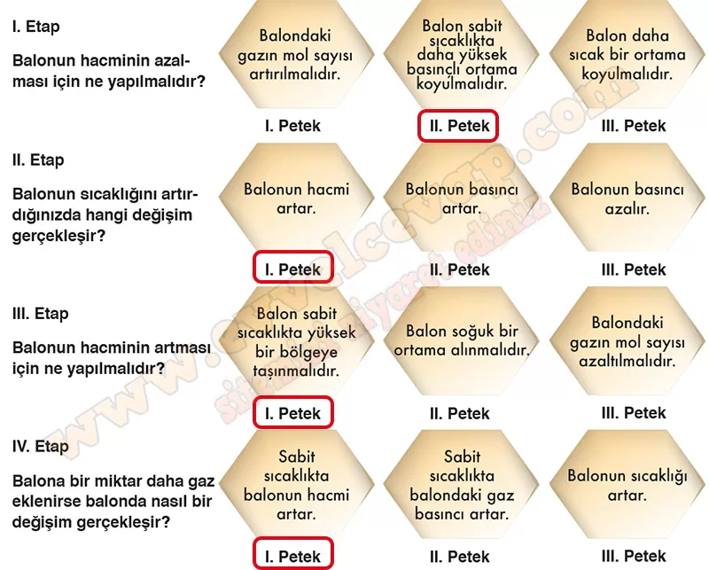
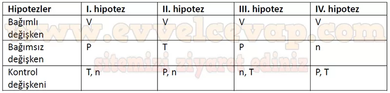

## 10. Sınıf Kimya Ders Kitabı Cevapları Meb Yayınları Sayfa 129

**Soru: 35-38. soruları aşağıdaki oyundan hareketle cevaplayınız.**

Bir kimya öğretmeni öğrencilerinin gazların özellikleri ile ilgili ilişkileri fark etmelerini sağlayacak bir bilgisayar oyunu hazırlamıştır. Oyunda, 1 mol gaz içeren elastik balon bulunmaktadır. Öğrenciler her etapta verilen soruya çözüm üreterek doğru peteği bulmaya çalışacaktır. Oyunun kuralları aşağıda verilmiştir:  
 • Her etapta sadece 1 petekte yer alan çözüm seçilebilir.  
 • Oyun dört etaptan oluşmaktadır.  
 • Dört etabı da doğru şekilde tamamlayan öğrenci oyunu kazanır.

**Soru: Balonun hacminin azalması için ne yapılmalıdır?**

* **Cevap**: II. Petek seçilerek hipotez oluşturulmalıdır.

**Soru: Balonun sıcaklığını artırdığınızda hangi değişim gerçekleşir?**

* **Cevap**: I. petek seçilerek hipotez oluşturulmalıdır.

**Soru: Balonun hacminin artması için ne yapılmalıdır?**

* **Cevap**: I. petek seçilerek hipotez oluşturulmalıdır.

**Soru: Balona bir miktar daha gaz eklenirse balonda nasıl bir değişim gerçekleşir?**

* **Cevap**: I. petek seçilerek hipotez oluşturulmalıdır.

**Soru: 35) Yukarıdaki problem durumlarını göz önüne alarak gazları niteleyen basınç-hacim, sıcaklık- hacim, basınç-sıcaklık ve hacim-madde miktarı (mol) arasındaki ilişkileri gösteren hipotezler oluşturunuz.**

**10. Sınıf Meb Yayınları Kimya Ders Kitabı Sayfa 129**