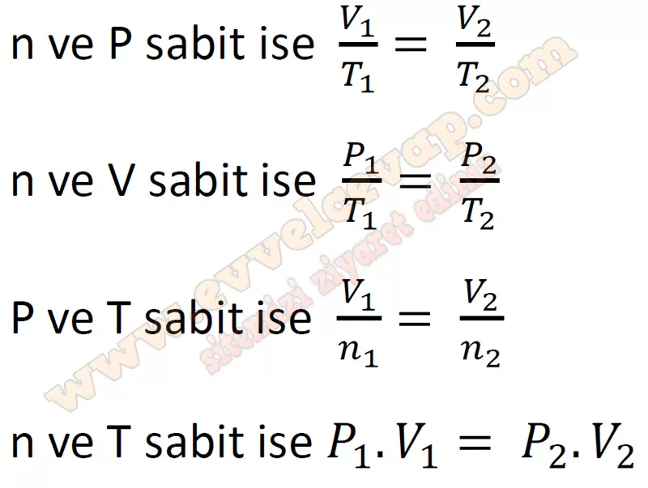

## 10. Sınıf Kimya Ders Kitabı Cevapları Meb Yayınları Sayfa 130

**Soru: 36) Her etapta değişen ve sabit tutulan iki özellik için bir grafik çizilmiştir. Verilen grafiklerden yararlanarak matematiksel bir eşitlik türetiniz.**

**10. Sınıf Meb Yayınları Kimya Ders Kitabı Sayfa 130**