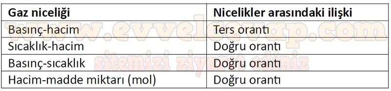

## 10. Sınıf Kimya Ders Kitabı Cevapları Meb Yayınları Sayfa 131

**Soru: 37) Aşağıdakilerden hangisi verilen dört etaptan herhangi birisinin araştırma sorusu olamaz?**

A) Bir miktar gazın sabit sıcaklıkta basıncı hacmi ile nasıl değişir?  
 B) Sabit sıcaklık ve basınçta madde miktarı ile hacim arasında nasıl bir ilişki bulunur?  
 C) Gaz tanecikleri bulundukları kabın her noktasına eşit oranda kuvvet uygular mı?  
 D) Sabit basınç altında sıcaklık ile hacim arasında nasıl bir ilişki vardır?  
 E) Dış basıncın değişmesi elastik balonun hacmini nasıl etkiler?

**Soru: 38) Gazların nicelikleri ile ilişkili tabloyu tamamlayınız.**

**Soru: 39-42. sorulan aşağıdaki metin ve tablodan yararlanarak cevaplayınız.**

Atmosferin bağıl nem ve sıcaklık ölçümlerinde hava durumu balonları kullanılır. Radyosonda denilen bir cihaz balona takılarak atmosfere gönderilir ve gerekli ölçümler yapılır. Balonun atmosferdeki hareketinden ise rüzgârın hızı ve yönü belirlenir. Hava durumu balonları kauçuktan yapılmış elastik balonlar olup zorlu atmosfer koşullarına dayanabilecek şekilde tasarlanmıştır. Hidrojen veya helyum gazı ile doldurulan ve yerden 35-40 km yükselebilen bu balonlar, hacimleri belli bir büyüklüğe ulaştığında patlar ancak sisteme monte edilen paraşüt sayesinde güvenle yeryüzüne ulaşabilir.

Bir hava durumu balonuna ait bazı veriler aşağıdaki tabloda verilmiştir.

* **Cevap**: **Bu etkinliğin cevabı diğer sayfadadır. (Bkz. sayfa 132)**

**10. Sınıf Meb Yayınları Kimya Ders Kitabı Sayfa 131**