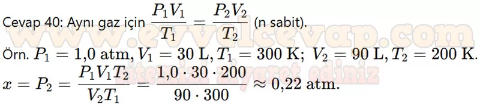
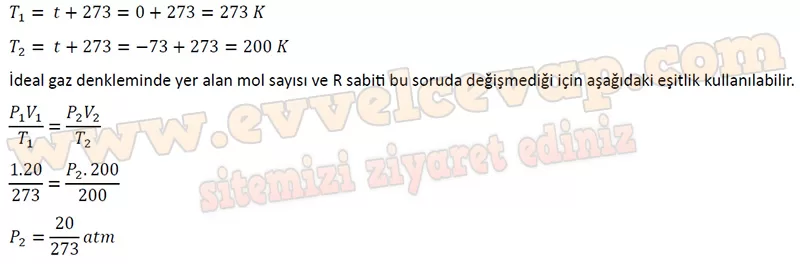
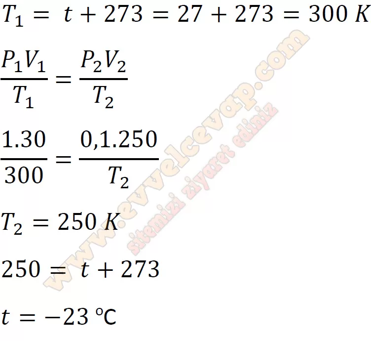

## 10. Sınıf Kimya Ders Kitabı Cevapları Meb Yayınları Sayfa 132

**Soru: 39) Verilen bilgilerden yola çıkılarak aşağıdaki örüntülerden hangisine ulaşılamaz?**

A) Belli bir sıcaklıkta bir gazın hacmi ile basıncı ters orantılıdır.  
 B) Sabit basınç altında gazların sıcaklığı arttıkça hacmi artar.  
 C) Belli bir basınçta madde miktarı ile hacim doğru orantılıdır.  
 D) Gazların basınç, hacim, miktar ve sıcaklık nicelikleri birbiri ile ilişkilidir.  
 E) Belli bir hacimde gazların basıncı ile sıcaklığı doğru orantılıdır.

**Soru: 40) Tablodaki x değerini hesaplayabileceğiniz bir bağıntı yazınız.**

**Soru: 41) 20 L hacmindeki bir hava durumu balonu hidrojen gazı ile doldurularak 0 °C sıcaklıkta deniz seviyesinden (1 atm basınçta) atmosfere bırakılıyor. Balon hacmi 200 L olduğu anda hava sıcaklığı -73 °C ise bu yükseklikteki açık hava basıncı kaç atm olur?**

**Soru: 42) Bir hava durumu balonunun hacmi 250 L’ye ulaştığında balon patlamaktadır. 27 °C sıcaklık ve 1 atm basınçta bırakılan 30 L hacme sahip hava durumu balonu dış basıncın 0,1 atm olduğu noktada patladığına göre bu yükseklikteki hava kaç °C sıcaklıktadır?**

**Soru: 43-44. soruları aşağıdaki metin ve görselden yararlanarak cevaplayınız.**

Efüzyon ve difüzyon olaylarını test etmek isteyen öğrenciler aşağıdaki gibi iki farklı deney tasarlıyor.  
 I. Adım: Bir öğrenci şekildeki cam balonlardan birine NH3 gazı koyarak düzeneğe bağlıyor.  
 II. Adım: Diğer cam balona bir miktar bakır katisı ve derişik nitrik asit çözeltisi ilave edip düzeneğe bağlıyor. Bakır ve nitrik asidin tepkimeye girmesini sağlıyor.  
 III. Adım: Aynı anda muslukları açarak cam boruda renk değişimi gözlenen bölgeyi işaretliyor.

**Efüzyon Deneyi**

I. Adım: Bir öğrenci özdeş iki balondan birini 1 mol azot gazıyla, diğerini de 1 mol helyum gazı ile dolduruyor.  
 II. Adım: İki balonun da ağzına küçük bir delik açıp kronometreyi çalıştırarak balonların tamamen söndüğü süreleri not alıyor.

* **Cevap**: **Bu etkinliğin cevabı diğer sayfadadır. (Bkz. sayfa 133)**

**10. Sınıf Meb Yayınları Kimya Ders Kitabı Sayfa 132**