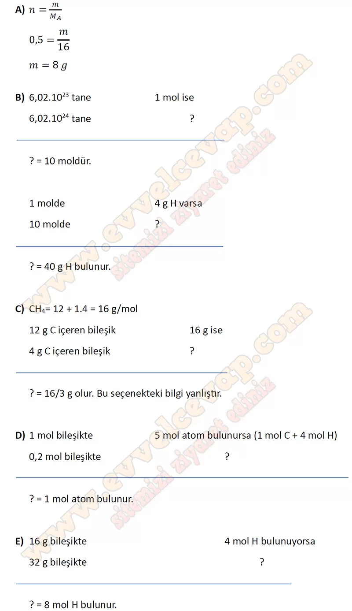
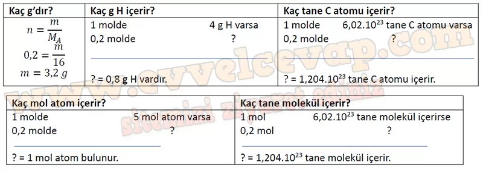

## 10. Sınıf Kimya Ders Kitabı Cevapları Meb Yayınları Sayfa 136

**Soru: 51) Metinde geçen tepkimelerin oluşum süreçlerini alt mikro seviyede tanecik modeli ile çizerek açıklayınız.**

**✅I. tepkime: Ca(k) + 2H₂O(s) → Ca(OH)₂(suda) + H₂(g)**

* **Alt mikro seviye gösterimi:** Ca atomları ile su molekülleri temas eder. Su moleküllerindeki O–H bağları kırılır, OH⁻ iyonları ve H₂ gazı açığa çıkar. Ca²⁺ iyonları ile OH⁻ iyonları birleşerek Ca(OH)₂ oluşturur.
* **Açıklama:** Metalik Ca, suyla yavaş tepkimeye girerek hidroksit ve H₂ gazı üretir.

---

**✅II. tepkime: Ca(OH)₂(suda) + 2HCl(suda) → CaCl₂(suda) + 2H₂O(s)**

* **Alt mikro seviye gösterimi:** Çözeltide Ca²⁺ ve OH⁻ iyonları serbest hâlde bulunur. HCl çözeltisinde H⁺ (H₃O⁺) ve Cl⁻ iyonları vardır. H⁺ iyonları OH⁻ iyonlarıyla birleşip H₂O oluşturur. Ca²⁺ iyonları Cl⁻ iyonlarıyla birleşerek çözeltide CaCl₂ oluşturur.
* **Açıklama:** Asit–baz nötralleşme tepkimesi gerçekleşir, tuz ve su oluşur.

---

**✅III. tepkime: Ca²⁺(suda) + 2HCO₃⁻(suda) → CaCO₃(k) + CO₂(suda) + H₂O(s)**

* **Alt mikro seviye gösterimi:** Çözeltide bulunan Ca²⁺ iyonları, bikarbonat (HCO₃⁻) iyonlarıyla etkileşir. HCO₃⁻ iyonlarının bir kısmı parçalanarak CO₃²⁻ ve CO₂ + H₂O oluşturur. Ca²⁺ iyonu CO₃²⁻ iyonlarıyla birleşerek suda az çözünen katı CaCO₃ çöker.
* **Açıklama:** Isıtıldığında CaCO₃ (kireç taşı) çökelir, CO₂ gazı açığa çıkar. Bu olay kireç taşı oluşumunun temelidir.

**Soru: 52-53. soruları aşağıdaki şekilde verilen bilgilere göre cevaplayınız.**

**Soru: 52) Verilen bilgilerden hareketle aşağıdaki çıkarımlardan hangisi yapılamaz?**

A) 0,5 mol CH4 8 g’dır.  
 B) 6,02 • 1024 tane CH4 molekülü 40 g H içerir.  
 C) 4 g C içeren bileşik 8 g’dır.  
 D) 0,2 mol bileşikte 1 mol atom bulunur.  
 E) 32 g bileşik 8 mol H atomu içerir.

**Soru: 53) Şekildeki bilgilerden yola çıkarak 0,2 mol CH4 molekülü için aşağıdaki tabloyu tamamlayınız.**

**10. Sınıf Meb Yayınları Kimya Ders Kitabı Sayfa 136**