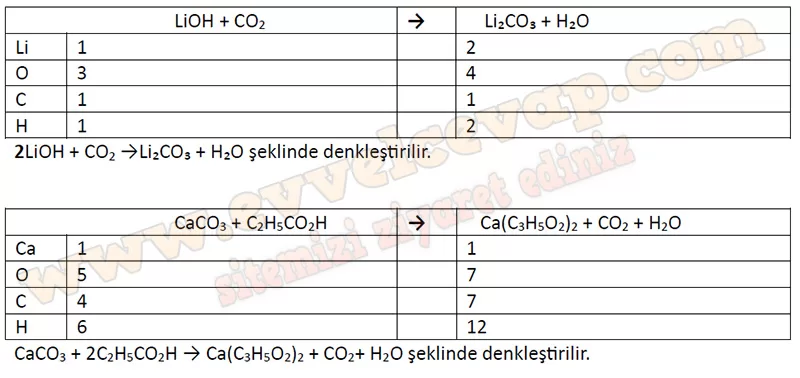

## 10. Sınıf Kimya Ders Kitabı Cevapları Meb Yayınları Sayfa 137

**Soru: 54-56. sorulan aşağıdaki metne göre cevaplayınız.**

Kalsiyum propiyonat [Ca(C3H502)2] ekmek ve diğer unlu mamullerin raf ömrünü uzatmak için kullanılan gıda katkı maddesidir. Kalsiyum propiyonat, kalsiyum tuzu formundadır ve propiyonik asidin (C2H5C02H) kalsiyum karbonat (CaC03) ile tepkimesi sonucu elde edilebilir. Kalsiyum, potasyum ve lityum elementlerinin oksitli veya hidroksitli bileşikleri, havadaki karbon dioksit ve su buharını tutmada aktif rol almaktadır. Maden ocakları, uzay araçları ve denizaltılar gibi kapalı ortamlarda solunan havadaki karbon dioksit miktarını düşürmek için lityum hidroksit kullanılır. Lityum hidroksit, karbon dioksit ile tepkimeye girerek lityum karbonat ve su oluşturur. Astronotların ürettiği karbon dioksidin güvenli seviyeye indirilmesi için kullanılacak LiOH miktarının belirlenmesi, denklemin doğru bir şekilde yazılmasına bağlıdır. Doğru denkleştirilmiş tepkimeler sayesinde işlemler güvenli ve verimli bir şekilde gerçekleştirilir.

**Soru: 54) Metinde geçen tepkimeleri göz önüne alarak aşağıdaki soruları cevaplayınız.**

**Soru: a) Bir tepkimenin denkleştirildiğini nasıl anlarsınız?**

* **Cevap**: Bir tepkimenin denkleştirildiğini anlamak için atom türü ve sayısı kontrol edilmelidir. Tepkimenin her iki tarafında da aynı sayıda atom ve aynı tür atomlar varsa tepkime denkleştirilmiş demektir.

**Soru: b) Karbon dioksit bileşiğindeki 2, bir katsayı mı yoksa bir alt simge midir?**

* **Cevap**: CO2 bileşiğindeki 2, oksijen atomunun bileşikte ne kadar bulunduğunu gösteren bir sayıdır.

**Soru: c) Bir katsayıyı değiştirmek ile alt simgeyi değiştirmek arasındaki fark nedir?**

* **Cevap**: Bir bileşiğin katsayısı değiştirildiğinde bileşikteki bütün atomlar bu değişimden etkilenir. Bileşikte bir atomun sayısı ise değiştirilemez. Bir atomun sayısı değişirse bileşik değişir.

**Soru: ç) Kimyasal denklemler denkleştirilirken hangi kurallara dikkat edilmelidir?**

* **Cevap**: Giren ve ürünlerdeki atom sayıları denkleştirilmelidir. En çok atom içeren molekülün genellikle sayısı 1 alınmalıdır. Bileşiklerin ve elementel hâldeki atomların katsayısı kesirli ifade olamaz.

**Soru: 55) Aşağıdaki tepkimelerdeki her bir atomun sayısını tabloya yazarak denkleştiriniz.**

**10. Sınıf Meb Yayınları Kimya Ders Kitabı Sayfa 137**