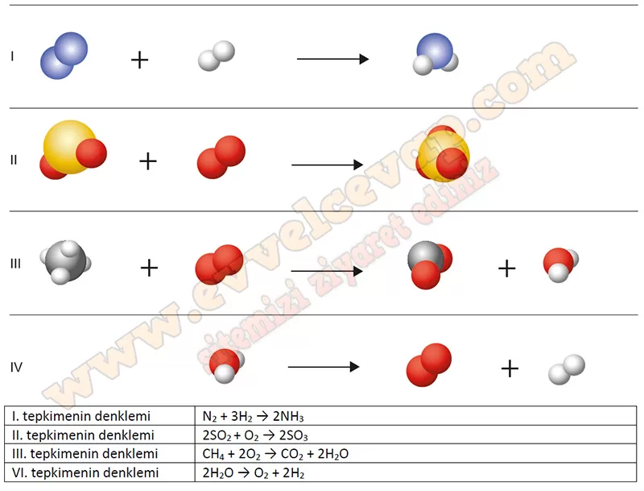

## 10. Sınıf Kimya Ders Kitabı Cevapları Meb Yayınları Sayfa 138

**Soru: 56) Aşağıda kükürt, oksijen, hidrojen, azot ve karbon elementleri temsilî şekille verilmiştir. Verilen elementlerin temsilî şekillerine dayalı olarak kimyasal tepkimeleri uygun tam sayılarla denkleştiriniz. Denkleştirdiğiniz tepkimelerin tepkime denklemlerinin aşağıdaki alana yazınız.**

**10. Sınıf Meb Yayınları Kimya Ders Kitabı Sayfa 138**