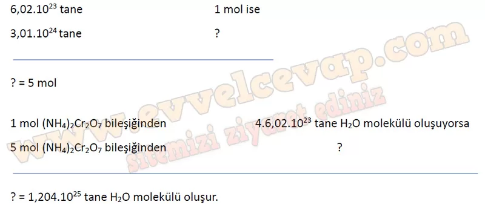
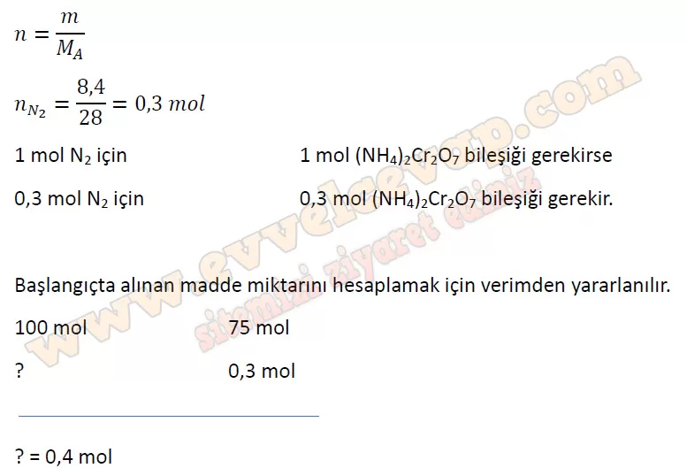
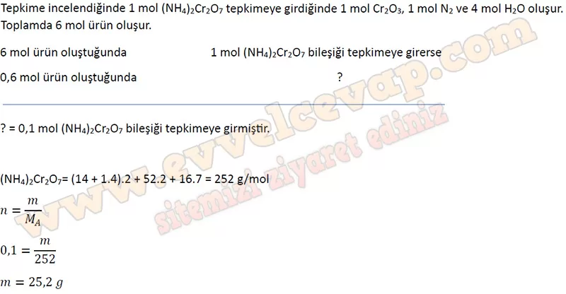

## 10. Sınıf Kimya Ders Kitabı Cevapları Meb Yayınları Sayfa 139

**Soru: 57-61. sorulan aşağıdaki metne göre cevaplayınız.**

Amonyum dikromat [(NH4)2Cr207] turuncu ve katı hâlde bir maddedir. Isıtıldığında görseldeki gibi amonyum dikromat yanardağı olarak bilinen güçlü bir tepkime oluşur. Burada oluşan yeşil renk, krom(lll) oksit bileşiğidir. Bu olaya ait denklem aşağıda verilmiştir:

**Soru: 57) Denklemde tepken ve ürünlerin katsayıları ile mol sayıları arasındaki ilişkiyle ilgili olarak aşağıdakilerden hangisi söylenemez?**

A) Kullanılan amonyum dikromat miktarı bilinirse elde edilen su miktarı hesaplanabilir.  
 B) Tepkime sonucunda oluşan Cr203 ile N2 gazı aynı mol sayısında oluşur.  
 C) Oluşan N2 gazının miktarı bilinirse amonyum dikromatın mol sayısı hesaplanabilir.  
 D) Oluşan suyun kütlesi ile Cr203 bileşiğinin kütlesi birbirine eşittir.  
 E) Harcanan amonyum dikromatla oluşan azot gazının mol sayıları aynıdır.

**Soru: 58) Tepkenden 0,5 mol alındığında ürünlerin kaçar mol oluşacağına dair bir zihin haritası oluşturunuz.**

* **Cevap**: Tepkenden bir mol alındığında 1 mol Cr2O3, 1 mol N2 ve 4 mol H2O oluşur. 0,5 mol alındığında ne kadar oluşacağını belirlemek için orantı kurulur.

**Soru: 59) 3,01 . 1024 tane amonyum dikromattan kaç tane su molekülü oluşur?**

**Soru: 60) %75 verimle gerçekleşen tepkimede 8,4 g N2 gazı oluştuğuna göre başlangıçta kaç mol amonyum dikromat alınmıştır? (N: 14 g/mol)**

**Soru: 61) Bir miktar amonyum dikromat ile başlatılan tepkime %100 verim ile gerçekleşmiştir. Oluşan toplam ürün miktarı 0,6 mol olduğuna göre başlangıçta kaç g amonyum dikromat kullanılmıştır?**

**10. Sınıf Meb Yayınları Kimya Ders Kitabı Sayfa 139**