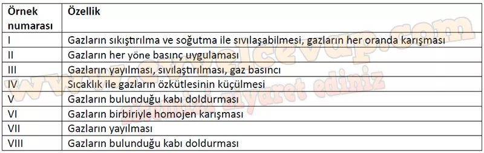

## 10. Sınıf Kimya Ders Kitabı Cevapları Meb Yayınları Sayfa 140

**Soru: 62-64. sorulan aşağıdaki ifadelerden hareketle cevaplayınız.**

Aşağıda gazların özellikleriyle ilgili günlük hayattan bazı örnekler verilmiştir:

I. Mutfak tüpleri, sıvılaştırılmış propan ve bütan gazlarının karışımıdır.  
 II. İçi su dolu bardağın ağzına kâğıt kapatılıp bardak ters çevrilirse su dökülmez.  
 III. Deodorant şişelerindeki itici gaz sıvının dışarıya püskürtülmesini sağlar.  
 IV. Sıcak hava ile doldurulan balonlar havada yükselir.  
 V. Anlık ve hızlı gerçekleşen bazı tepkimeler ile hava yastıklarının şişmesi gerçekleşir.  
 VI. Atmosferde azot, oksijen, karbon dioksit ve argon gibi çeşitli gazlar bulunur.  
 VII. Odanın bir köşesine sıkılan parfümün kokusu zamanla tüm odaya yayılır.  
 VIII. Araba ve bisiklet lastikleri hava ile doldurulur.

**Soru: 62) Bu örnek ifadelere göre gazların katı ve sıvılardan farklarına ilişkin aşağıdakilerden hangisi söylenemez?**

A) Gazların belli bir hacmi ve şekli yoktur.  
 B) Katı ve sıvılar sıkıştırılamaz ancak gazlar sıkıştırılabilir.  
 C) Genleşme sadece gazlara ait bir özelliktir.  
 D) Parfüm kokusunun odaya yayılması gazların sıvılar gibi akışkan olduğunu gösterir.  
 E) Gazlar bulundukları kabın her bölgesine eşit basınç uygular.

**Soru: 63) Yukarıda verilen örneklerden yararlanarak gazların özelliklerine ilişkin verileri aşağıdaki tabloya kaydediniz.**

**10. Sınıf Meb Yayınları Kimya Ders Kitabı Sayfa 140**