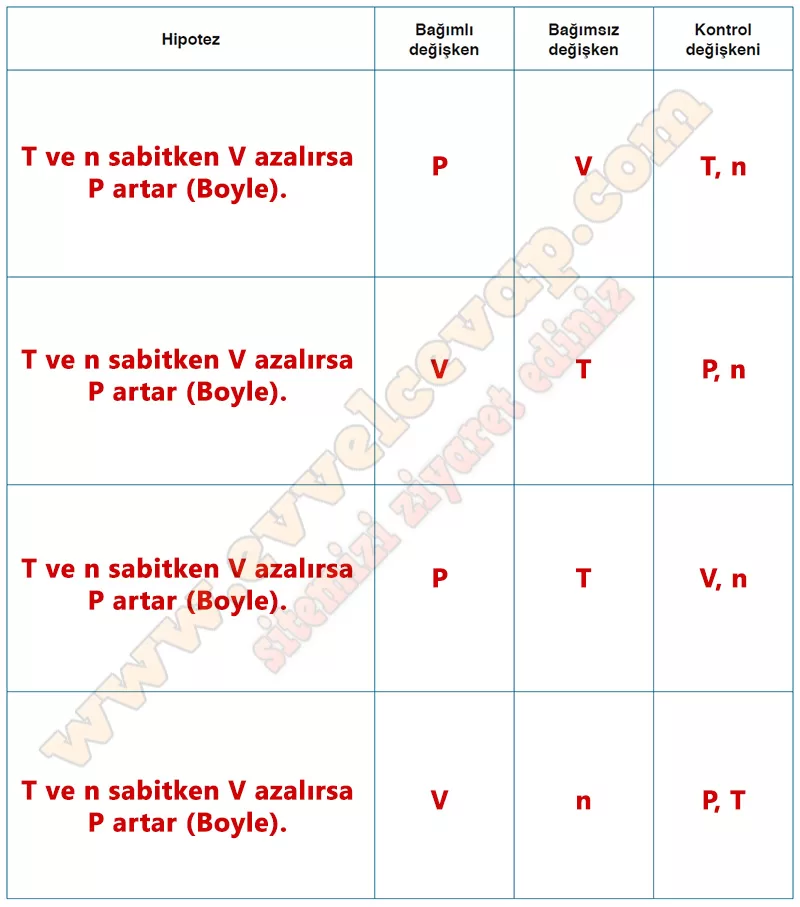

## 10. Sınıf Kimya Ders Kitabı Cevapları Meb Yayınları Sayfa 142

**Soru: 66) Topun inme nedeninin gazların hacim, basınç, sıcaklık ve madde miktarı nicelikleriyle ilişkili olduğunu düşünen öğrenci, araştırmaları sonucunda aşağıdaki bilgilere ulaşıyor:** • Su kabarcıkları sıvının dibinden yüzeyine doğru hareket ederken büyür.  
 • Sıcak hava balonlarının yükselmesi havanın genleşmesi prensibine dayanır.  
 • Düdüklü tencerelerde yemekler daha yüksek basınçla pişer.  
 • Elastik balonlar şişirildikçe hacimleri büyür. **Buna göre basınç-hacim, sıcaklık-hacim, sıcaklık-basınç ve madde miktarı (mol)-hacim arasındaki ilişkileri gösteren hipotezler oluşturunuz. Oluşturduğunuz hipotezleri aşağıdaki tabloya yazarak bağımlı, bağımsız değişkenleri ve kontrol değişkenlerini belirleyiniz.**

**10. Sınıf Meb Yayınları Kimya Ders Kitabı Sayfa 142**