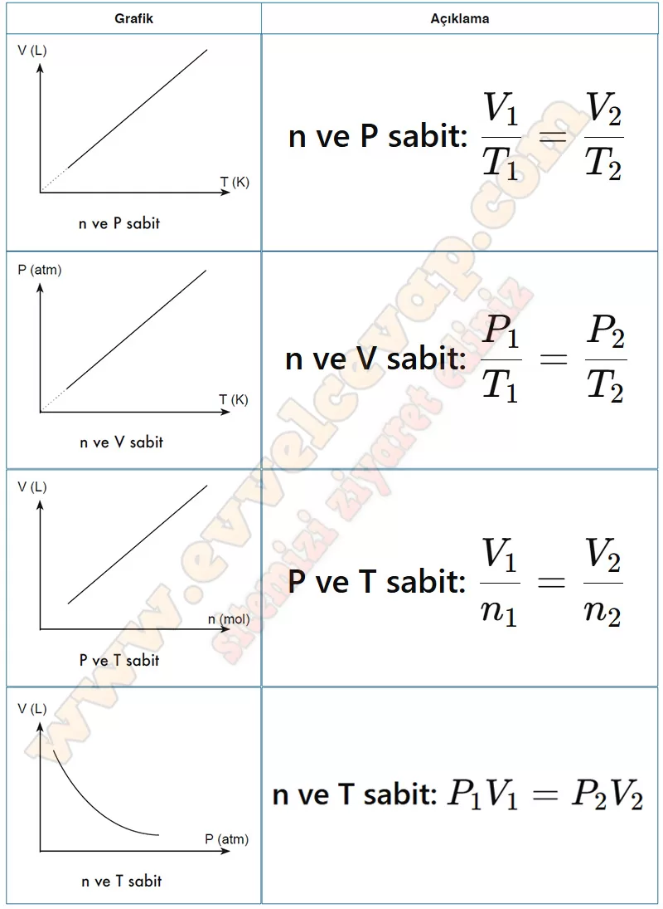

## 10. Sınıf Kimya Ders Kitabı Cevapları Meb Yayınları Sayfa 144

**Soru: 68) Yazdığınız ilişkilendirmelerden yola çıkarak aşağıdaki grafiklere uygun matematiksel modeller yazınız.**

**10. Sınıf Meb Yayınları Kimya Ders Kitabı Sayfa 144**