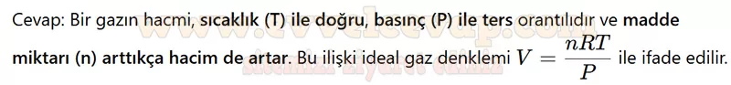
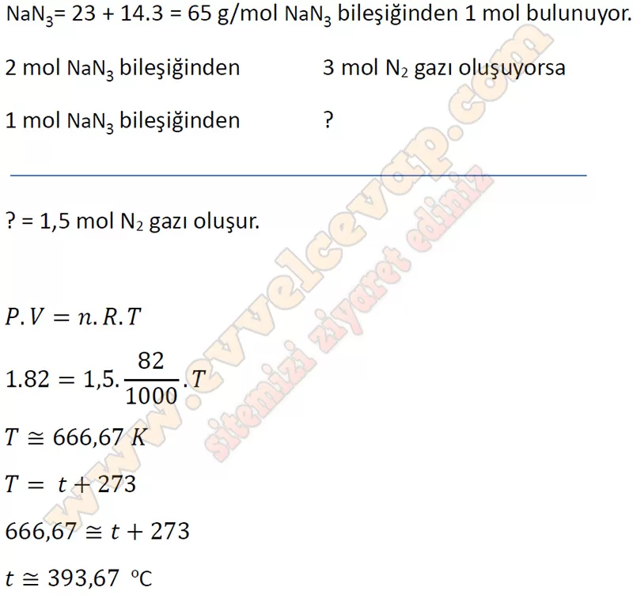

## 10. Sınıf Kimya Ders Kitabı Cevapları Meb Yayınları Sayfa 146

**Soru: 71) Bir gazın hacminin bağlı olduğu niceliklere ilişkin bir ifade yazınız.**

**Soru: 72) Bir otomobilin hava yastığını şişirmek için 65 g NaN3 bileşiği kullanılmıştır. Hava yastığının 1 atm basınçlı ortamda açıldığı andaki hacmi yaklaşık 82 L olduğuna göre tepkimenin gerçekleştiği ortamın sıcaklığı kaç “C’tur?**

**Soru: 73-77. sorulan aşağıdaki metne göre cevaplayınız.**

Atmosferdeki kirletici gazlar, doğal veya insan kaynaklı olarak atmosfere salınan ve havanın kalitesini bozan gazlardır. Sanayi tesislerinin yakınında yoğun bir şekilde bulunan bu gazlar zamanla daha geniş alanlara yayılır. Bir grup öğrenci, kirletici gazların atmosferdeki difüzyon ve efüzyon süreçlerini incelemek amacıyla laboratuvarda bir deney tasarlamıştır. Karbon monoksit (CO), kükürt dioksit (S02), metan (CH4) ve hidrojen sülfür (H2S) gibi gazlar özdeş kaplarda serbest bırakılmış ve 10 metre uzaklıktaki dedektörlere ne kadar sürede ulaştıkları gözlenmiştir. Öğrenciler deneyde gazların difüzyon hızlarını karşılaştırmak istemektedir. Deneyde kullanılan gazların mol kütleleri g/mol cinsinden sırasıyla şu şekildedir: CO: 28, S02: 64, CH4: 16, H2S: 34.

**Soru: 73) Hangi gazın dedektöre en hızlı ulaşmasını beklersiniz? Neden?**

* **Cevap**: Molekül kütlesi küçük gazlar, molekül kütlesi büyük olan gazlara göre daha hızlı yayılır. Bu nedenle metan diğer gazlardan daha hızlı yayılacaktır.

**Soru: 74) Sabit sıcaklıkta gazların dedektöre ulaşma sürelerini kıyaslayınız.**

* **Cevap**: Gazların aynı şartlarda dedektöre ulaşma süreleri SO₂ > H₂S > CO > CH₄ şeklindedir.

**10. Sınıf Meb Yayınları Kimya Ders Kitabı Sayfa 146**