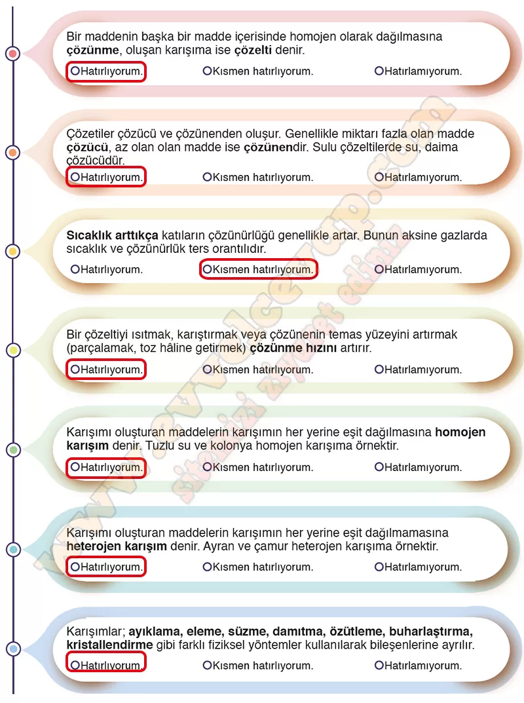

## 10. Sınıf Kimya Ders Kitabı Cevapları Meb Yayınları Sayfa 150

**Hazır mısınız?**

**Soru: Aşağıda “Çeşitlilik” teması ile ilgili temel kavramlar verilmiştir. Verilen bilgiler doğrultusunda hatırlama düzeyinize göre kendinize uygun olan kutucuğu işaretleyiniz. Eksiklerinizin olduğunu düşündüğünüz konular için tema öncesinde gerekli tekrarları yapabilirsiniz.**

**10. Sınıf Meb Yayınları Kimya Ders Kitabı Sayfa 150**