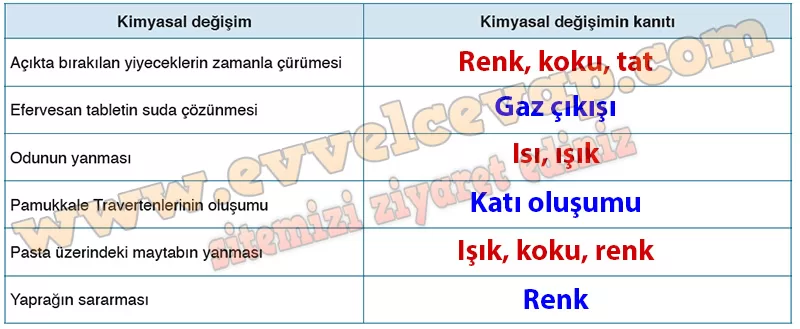

## 10. Sınıf Kimya Ders Kitabı Cevapları Meb Yayınları Sayfa 22

**Etkinlik**

**Adı**: Kimyasal Değişim  
 **Amacı**: Kimyasal değişimlere ilişkin gözlem yapabilme  
 **Süresi**: 40 dakika  
 **Güvenlik**: Etkinliğin sağ üst köşesinde verilen güvenlik işaretlerinin anlamlarını kitabın 17. sayfasından okuyunuz ve Önlemleri deney için gereken tedbirleri alınız.

Bu etkinliğe ilişkin değerlendirme, kitabın sonunda yer alan “Ekler” bölümündeki 1. form ile öğretmen tarafından, 2. form ile öğrenci tarafından yapılacaktır.

**Soru: Aşağıdaki basamakları takip ederek etkinliği gerçekleştiriniz. Basamakları tamamladıktan sonra “Değerlendirme” bölümündeki soruları cevaplayınız.**

**Soru: 1) Günlük hayatta karşınıza çıkan kimyasal değişimleri göz önüne alarak kimyasal değişimin göstergelerinin neler olabileceğini arkadaşlarınızla tartışınız.**

* **Cevap**: Kimyasal değişimlerde renk değişimi, gaz çıkışı, ısı ve ışık oluşumu, koku değişimi ve yeni madde oluşumu gözlenebilir.

**Soru: 2) Aşağıdaki görsellerde bazı kimyasal değişim örnekleri verilmiştir. Verilen her bir örnek için kimyasal değişimin kanıtını aşağıdaki tabloya yazarak açıklayınız.**

**10. Sınıf Meb Yayınları Kimya Ders Kitabı Sayfa 22**