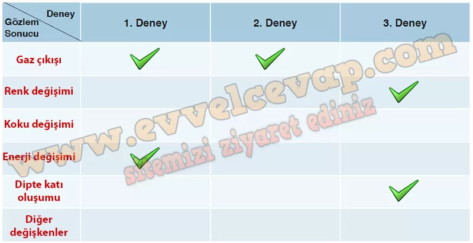

## 10. Sınıf Kimya Ders Kitabı Cevapları Meb Yayınları Sayfa 23

**Soru: 3) Öğretmeniniz gözetiminde 4-6 kişilik gruplara ayrılınız ve aşağıdaki deneyleri yapınız. Deney esnasında ve sonrasında yaptığınız gözlemleri ve gözlem sonuçlarınızın nedenlerini araştırmacı ve sorgulayıcı bir bakış açısı ile grup arkadaşlarınızla tartışınız.**

**Deneyin Adı**: Kimyasal Değişim  
 **Deneyin Amac**ı: Farklı kimyasal tepkimelerdeki değişimleri gözlemleyebilme  
 **Malzemeler**: 50 mL CH3COOH (sirke asidi), 1 g NaHC03 (yemek sodası), 50 mL H202 (hidrojen peroksit, %30’luk), bulaşık deterjanı, 2 g KI (potasyum iyodür), 1 g Pb(NO3)2 [Kurşun(II) nitrat], erlenmayer (250 mL), 2 adet beherglas (100 mL), dereceli silindir (250 mL), elastik balon, huni, spatül, baget, hassas terazi, saf su

**Deneyin Yapılışı**

1. Deney: Dereceli silindire 50 mL H2Ö2 koyunuz. Üzerine bir miktar bulaşık deterjanı ekleyiniz ve karıştırınız. Daha sonra 1 g KI katisını tek seferde dereceli silindire ilave ediniz ve değişimi gözlemleyiniz.  
 2. Deney: Erlenmayere 50 mL CH3COOH koyunuz. Elastik balonun ağzına bir huni geçirip içine 1 g NaHCÖ3 ekleyiniz. Elastik balonu, içindeki yemek sodası dökülmeyecek şekilde dikkatlice erlenmayerin ağız kısmına geçiriniz. Elastik balon ile erlenmayerin ağzını tamamen kapattıktan sonra balonun içindeki yemek sodasını erlenmayerin içerisine hızlıca ilave ediniz ve değişimi gözlemleyiniz.  
 3. Deney: Bir beherglasın içerisine yaklaşık 50 mL saf su koyunuz. 1 g Pb(N03)2 ilave ederek karıştırınız ve katının tamamen çözünmesini sağlayınız. Başka bir beherglasa yaklaşık 50 mL saf su koyunuz. 1 g KI ilave ederek karıştırınız ve katının tamamen çözünmesini sağlayınız. Daha sonra beherglaslardaki çözeltilerden birini diğerinin üzerine dikkatli bir şekilde ilave ediniz ve değişimi gözlemleyiniz.

**Bulgular ve Sonuç**

**Soru: 1) Deneyler esnasında elde ettiğiniz verilere göre aşağıdaki tabloyu ilgili yerlere “✓” işareti koyarak tamamlayınız.**

**Soru: 2) Yaptığınız deneylerde kimyasal değişimin gözlemlenebilir özelliklerini gördünüz. Aşağıda verilen soruları grup arkadaşlarınızla tartışınız. Tartışma sonucunda ulaştığınız ortak fikirleri yazınız.**

**Soru: Kimyasal değişimlerde gözlemlenemez değişimler var mıdır?**

* **Cevap**: Evet, atomların dizilişi ve bağ yapısı değişir ama bunlar gözle çıplak şekilde görülmez.

**Soru: Kimyasal değişimlerde tanecikler arasında nasıl bir etkileşim olabilir?**

* **Cevap**: Tanecikler arasında bağlar kırılır ve yeni bağlar kurulur, böylece yeni maddeler oluşur.

**10. Sınıf Meb Yayınları Kimya Ders Kitabı Sayfa 23**