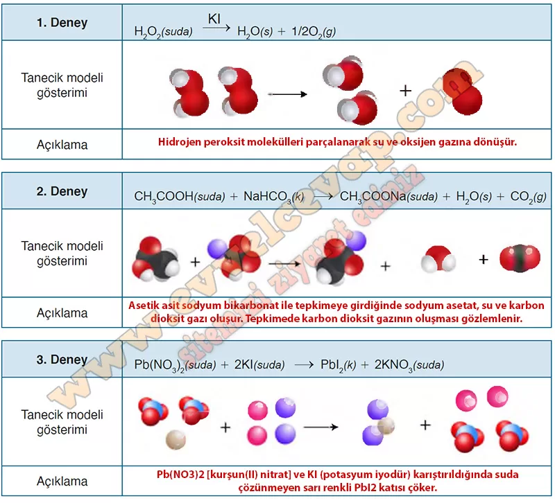

## 10. Sınıf Kimya Ders Kitabı Cevapları Meb Yayınları Sayfa 24

**Soru: 3) Yaptığınız deneylerin tepkime denklemleri aşağıda verilmiştir Tepkime denklemlerinden yola çıkarak gözlemlediğiniz değişimleri alt mikro seviyede, taneciklerin yeniden düzenlenmesi temelinde açıklayınız (Tanecik modelini çizerken farklı tür atomları farklı renk ve şekillerle gösterebilirsiniz.).**

**Soru: 1) Kimyasal değişimin gözlemlediğiniz değişkenler dışında farklı kanıtlan olabilir mi? Günlük hayattan örnekler vererek açıklayınız.**

* **Cevap**: Katı oluşumu, renk değişimi, gaz çıkışı, farklı bir koku oluşması ve enerji değişimi gibi durumlar maddenin kimyasal değişime uğradığının kanıtıdır.

**Soru: 2) Bir gözlemci, iki maddeyi birbiri içinde karıştırdığında bunun sadece bir karışım mı olduğunu yoksa maddelerin kimyasal tepkimeye mi girdiğini nasıl belirleyebilir? Örneklerle açıklayınız.**

* **Cevap**: Gözlemlenebilir değişkenlerde oluşan farklılıklar izlenerek maddelerin kimyasal değişime uğradığı fark edilebilir.

**Soru: 3) Kimyasal değişimi tanecik boyutunda incelediğinizde maddelerin iç yapılarındaki değişimle ilgili neler söyleyebilirsiniz? Arkadaşlarınızla tartışınız.**

* **Cevap**: Kimyasal değişimde atomlar arasındaki bağlar kırılır ve yeni bağlar oluşur. Yani taneciklerin dizilişi değişir ve farklı özelliklere sahip yeni maddeler meydana gelir.

**10. Sınıf Meb Yayınları Kimya Ders Kitabı Sayfa 24**