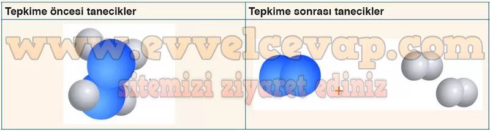

## 10. Sınıf Kimya Ders Kitabı Cevapları Meb Yayınları Sayfa 26

**Kontrol Noktası**

**Soru: 1) Özdeş iki kaba eşit miktarda su ilave ediliyor. Daha sonra kaplardan birine sirke asidi, diğerine ise yemek sodası ekleniyor ve sıvılar özdeş ısıtıcılarda kaynatılıyor. Kaplarda gözlemlenen durum ve tepkime denklemleri aşağıda gösterilmiştir.**

**Soru: a) Kaplarda oluşan kabarcıkların sebebi nedir? Açıklayınız.**

* **Cevap**: Birinci kapta ısının etkisiyle su ve sirke asidi karışımı kaynadığı için kabarcıklar oluşmuştur. İkinci kapta ısının etkisiyle bir miktar su kaynamış olsa da temel sebep, yemek sodasının ısının etkisiyle tepkimeye girmesi ve karbon dioksit gazı açığa çıkmasıdır.

**Soru: b) Kaplarda meydana gelen değişimi taneciklerin düzenlenmesi temelinde açıklayınız.**

* **Cevap**: Birinci kapta tepkenler ve ürünlerdeki moleküllerin yapıları değişmemiştir. Dolasıyla bu bir fiziksel değişimdir. Ancak ikinci kapta tanecikler arasındaki bağlar kopmuş ve yeniden düzenlenerek farklı moleküllere dönüşmüştür. Dolayısıyla bu bir kimyasal değişimdir.

**Soru: 2) Olay yeri inceleme ekipleri, suç mahallindeki görünmeyen kan izini ortaya çıkarmak için olay yerine luminol içeren sıvı püskürtür. Luminol, karartılan ortamda bazı yerlerde mavimsi bir parıltı oluşturur. Bu sayede silinmiş kan izleri tespit edilebilir. Bu olaya lüminesans (ışıldama), bu ışıldamanın canlılar tarafından yapılmasına ise biyolüminesans denir. Luminol bileşiğinin meydana getirdiği kimyasal tepkimenin gözlemlenebilir kanıtına benzer, günlük hayatta veya doğadaki canlılarda meydana gelen kimyasal tepkimelere üç örnek veriniz.**

* **Cevap**: Luminol bileşiğinin tepkimesinin kimyasal kanıtı ışıktır. Ateş böcekleri, bazı deniz anaları, neon ve floresan lambalar, kutup ışıkları, bazı sentetik boyalar, fosfor çubukları vs.

**Soru: 3) Sıvı hidrazin (N2H4), roketlerde yakıt olarak kullanılan bir bileşiktir. Bir katalizör yardımıyla hızlı bir şekilde tepkimeye giren hidrazin, parçalanarak azot ve hidrojen gazına dönüşür. Tepkime sonunda açığa çıkan gazların ve ısının etkisiyle rokete gerekli itiş gücü sağlanır. Hidrazinin roket yakıtı olarak kullanımında meydana gelen tepkimeyi taneciklerin yeniden düzenlenmesi temelinde aşağıdaki alana çizerek açıklayınız.**

**10. Sınıf Meb Yayınları Kimya Ders Kitabı Sayfa 26**