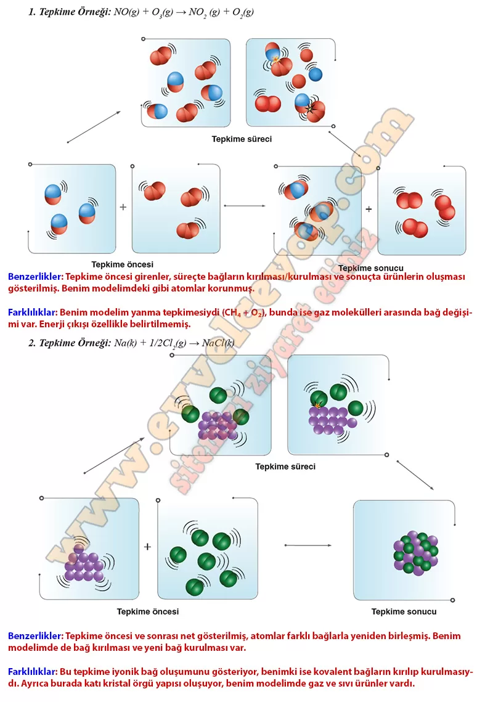

## 10. Sınıf Kimya Ders Kitabı Cevapları Meb Yayınları Sayfa 29

**Soru: 3) Aşağıda bazı tepkimelerin alt mikro seviyede süreç aşamalı gösterimleri verilmiştir. Tepkime modellerini inceleyerek kendi modelinizle arasındaki benzerlik ve farklılıklar açıklayınız.**

**10. Sınıf Meb Yayınları Kimya Ders Kitabı Sayfa 29**