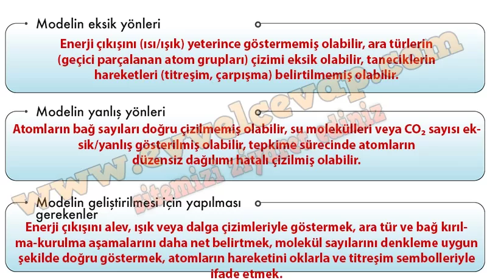

## 10. Sınıf Kimya Ders Kitabı Cevapları Meb Yayınları Sayfa 30

**Soru: 4) Aşağıdaki karekodda bir tepkimenin gerçekleşme sürecine ilişkin video verilmiştir Karekoddaki videoyu izleyiniz. Çizmiş olduğunuz modelin eksik veya yanlışlarını tespit ediniz. Modelinizi geliştirmek için neler yapabileceğinizi tartışarak aşağıdaki tabloyu tamamlayınız.**

**Değerlendirme**

**Soru: 1) Bir kimyasal tepkimenin gerçekleşmesi için tanecikler arasındaki etkileşimler nasıl olmalıdır? Düşüncelerinizi yazınız.**

* **Cevap**: Bir kimyasal tepkimenin gerçekleşmesi için taneciklerin yeterli enerjiyle ve doğru yönde çarpışması gerekir.

**Soru: 2) Bir kimyasal tepkimede tanecikler ve taneciklerin hareketleri gösterilirken nelere dikkat edilmesi gerekir? Gerekçelendirerek açıklayınız.**

* **Cevap**: Bir kimyasal tepkimede her bir tanecik farklı renk veya şekillerle gösterilmelidir. Bu maddelerin birbirinden farklı olduğunu ayırt etmeyi sağlar. Ayrıca tanecikler titreşim, öteleme ve dönme hareketleri yaptıkları için bu hareketler yay ayraç, iz veya gölge gibi belirteçler kullanılarak gösterilebilir.

**10. Sınıf Meb Yayınları Kimya Ders Kitabı Sayfa 30**