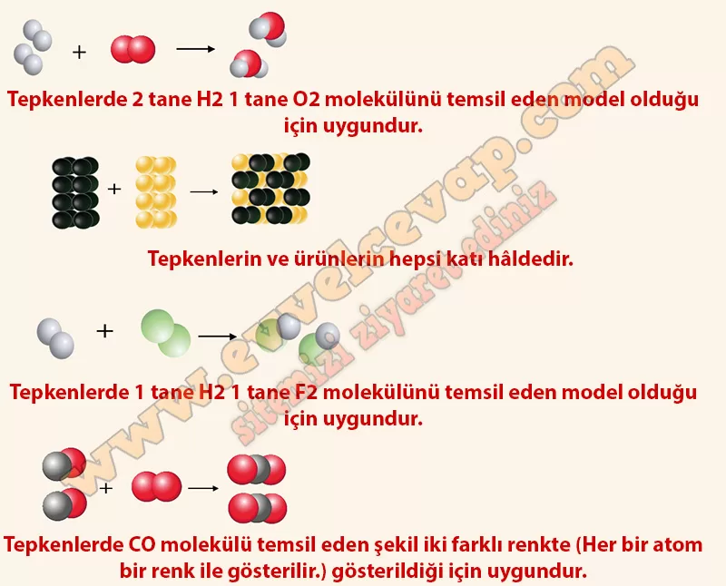

## 10. Sınıf Kimya Ders Kitabı Cevapları Meb Yayınları Sayfa 32

**Kontrol Noktası**

**Soru: 1) Aşağıda bazı tepkimeler alt mikro seviyede modellenmiştir. Bu modellerin Fe(k) + S(k)→ FeS(k) Hig) + F(g)→ 2HF(g) 2Hig) + (g)→ 2Hp(s) 2CO(g) + (g)→ 2C0(g) denklemlerinin verilen tepkimelere ait olduğu bilinmektedir. Buna göre her bir modelin altına ait olduğu tepkime denklemini gerekçelendirerek yazınız.**

**Soru: 2) Alüminyum metali havadaki oksijen gazı ile tepkimeye girdiğinde alüminyum metalinin yüzeyi sert Al203 bileşiği ile kaplanır ve alt kısımda bulunan alüminyum metali dış etkilerden korunmuş olur. Bu sayede gazlı içecekler alüminyum kaplarda saklanabilir. Alüminyum metalinin havadaki oksijen gazı ile tepkimesi aşağıdaki gibidir: Yukarıda sembolik düzeyde verilen tepkimenin oluşum sürecini alt mikro seviyede aşağıdaki kutucuklara modelleyiniz.**

* **Cevap**: Cevabı öğrenciye bırakılmıştır.

**10. Sınıf Meb Yayınları Kimya Ders Kitabı Sayfa 32**