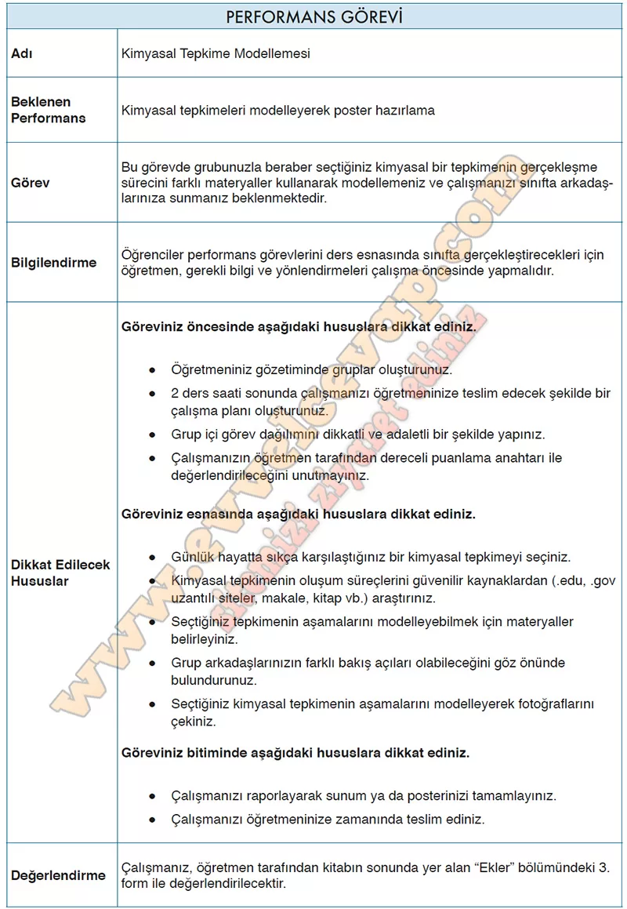

## 10. Sınıf Kimya Ders Kitabı Cevapları Meb Yayınları Sayfa 33

**KİMYASAL TEPKİME MODELLEMESİ**

**Seçilen Tepkime:** Metanın Yanması  
**Denklem:** CH₄(g) + 2O₂(g) → CO₂(g) + 2H₂O(g) + Enerji

---

**✅1. Tepkime Öncesi**

• Tepkimeye girecek maddeler: **Metan (CH₄)** ve **Oksijen (O₂)**.

• Metan molekülü 1 karbon ve 4 hidrojen atomundan oluşur.

• Oksijen molekülü iki oksijen atomundan oluşur, tepkime için 2 tane O₂ gerekir.

• Bu aşamada atomlar **kararlı bağlarla** kendi molekülleri içinde bulunur.

---

**✅2. Tepkime Süreci**

**• Çarpışma:** CH₄ ve O₂ molekülleri yüksek enerjiyle çarpışır.

**• Bağların kırılması:** CH₄’teki C–H bağları ve O₂’deki O=O bağları kırılır.

**• Yeni bağların kurulması:** Karbon ile oksijen bağ yaparak **CO₂**, hidrojen ile oksijen bağ yaparak **H₂O** oluşur.

**• Enerji açığa çıkar:** Bağların yeniden kurulması sırasında ısı ve ışık enerjisi çevreye yayılır.

---

**✅3. Tepkime Sonucu**

**Ürünler:**

* 1 molekül karbondioksit (CO₂)
* 2 molekül su (H₂O)

• Tepkime sonucunda açığa çıkan enerji ısı ve ışık olarak gözlemlenir.

• Atomlar yok olmaz, sadece **yeniden düzenlenir** (Kütlenin korunumu).

---

**✅4. Modelleme Önerisi (Poster İçin)**

**• Tepkime öncesi kutusu:** CH₄ molekülünü (C = siyah, H = beyaz) ve O₂ moleküllerini (O = kırmızı) çiz.

**• Tepkime süreci kutusu:** Molekülleri çarpıştır, bağların kırıldığını ve yeni bağların kurulduğunu oklarla göster.

**• Tepkime sonucu kutusu:** CO₂ ve H₂O moleküllerini göster, yanına alev/ışık çizerek enerji çıkışını belirt.

• Üç kutucuk altına kısa açıklamalar ekle: “Bağ kırılması”, “Yeni bağ oluşumu”, “Enerji açığa çıkışı”.

---

**✅5. Günlük Hayatla İlişkilendirme**

• Metanın yanması doğal gazın yanmasıdır.

• Evlerde kullanılan ocak, soba, şofben gibi aletlerde bu tepkime gerçekleşir.

• Enerji elde etmek için çok önemlidir ama yanma sonucu çıkan CO₂ sera gazı etkisi yapar.

---

**✅6. Grup Çalışması İçin Notlar**

• Bir kişi **çizimleri** yapmalı, bir kişi **metni** yazmalı.

• Poster sunumunda herkes farklı bir kısmı anlatmalı (öncesi, süreci, sonucu).

• Postere renkli kalemler veya baskılarla görsellik katılmalı.

**10. Sınıf Meb Yayınları Kimya Ders Kitabı Sayfa 33**