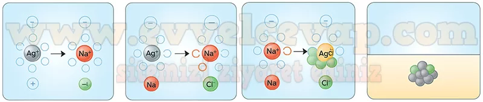

## 10. Sınıf Kimya Ders Kitabı Cevapları Meb Yayınları Sayfa 36

**Soru: 2) Aşağıda verilen deneyi gerçekleştiriniz.**

**Deneyin Adı**: Çökelme Tepkimesi

**Deneyin Amacı**: Çökelme tepkimelerinin oluşumunu gözlemleyebilme

**Malzemeler**: AgNÖ3 çözeltisi, NaCI çözeltisi, 2 adet deney tüpü, dereceli silindir, pipet, puar

**Bilgilendirme**: Bu etkinlikte kullanılacak çözeltiler öğretmen tarafından hazır bulundurulmalıdır.

**Deneyin Yapılışı**

**Soru: Bir deney tüpüne NaCI çözeltisinden 10 mL alınız. Üzerine 10 mL AgN03 çözeltisini damla damla ilave ediniz. Deney sırasında meydana gelen değişimleri gözlemleyerek kaydediniz.**

* **Cevap**: Deney sırasında NaCl çözeltisine AgNO₃ çözeltisi damlatıldığında **beyaz renkli AgCl çökeleği** oluşur. Çözelti bulanıklaşır ve katı tanecikler dipte toplanır. Bu durum **çökelme tepkimesinin** gerçekleştiğinin gözle görülür kanıtıdır.

**Bulgular ve Sonuç**

**Soru: 1) Çökelme tepkimesinin oluşum sürecini, gözlem sonucu elde ettiğiniz verilerden hareketle alt mikro seviyede tanecik davranışları ve etkileşimlerini de dikkate alarak aşağıdaki kutucuklara detaylı bir şekilde çiziniz.**

**Soru: 2) Çökelme tepkimesinin oluşum sürecini gösteren videoya ulaşmak için karekodu kullanınız. Deney sonucunda yapmış olduğunuz açıklamalarla etkileşimli içerikte yer alan animasyondaki gözlemlerinizi T tablosuna yazarak karşılaştırınız.**

**✅Benzerlikler:** Bulanıklık ve beyaz AgCl çökeleği oluştu, seyirci iyonlar çözeltide kaldı, çökelek dibe toplandı.

**✅Farklılıklar:** Videoda iyon hareketleri ve kristal oluşumu ayrıntılı gösterildi, deneyde sadece çökelek gözlendi.

**10. Sınıf Meb Yayınları Kimya Ders Kitabı Sayfa 36**