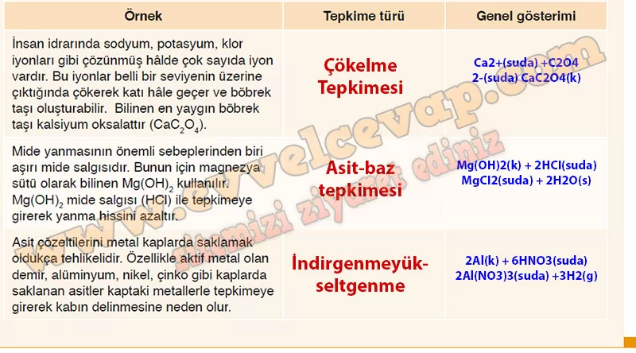

## 10. Sınıf Kimya Ders Kitabı Cevapları Meb Yayınları Sayfa 45

**Soru: Yandaki görselde hidrojen yakıt pilinin gösterimi verilmiştir. Hidrojen yakıt pili en basit hâliyle potasyum hidroksit gibi 02 bir elektrolit ve iki inert elektrottan oluşur. Anotta hidrojen, katotta oksijen gazının harcandığı tepkimeler aşağıda verilmiştir: Buna göre tepkime ile ilgili aşağıdaki soruları cevaplayınız.**

**Soru: a) Yakıt pilinde gerçekleşen tepkimenin türünü yazınız.**

* **Cevap**: İndirgenme-yükseltgenme tepkimesi

**Soru: b) Toplam tepkimenin oluşum sürecini, sembolik ve alt mikro seviyede tanecik davranışları ve etkileşimlerini dikkate alarak detaylı bir şekilde aşağıdaki kutucuklara çiziniz.**

**Soru: 4) Baryum sülfat, sindirim kanalını radyolojik olarak görüntülemek amacıyla kullanılır. Bu bileşik vücuda verilen X ışınlarını dokulardan daha çok absorbe ettiği için film üzerinde dokulara göre daha açık tonda görüntü elde edilir. Laboratuvar ortamında baryum sülfatı elde etmek için kullanmanız gereken asit ve baz çiftini belirleyerek tepkime denklemini yazınız.**

Ba(OH)2 ve H2SO4 tepkimeye girdiğinde BaSO4 ve H2O oluşur.  
 Ba(OH)2(suda) + H2SO4(suda) → BaSO4(suda) + 2H2O(s)

**Soru: 5) Aşağıdaki tabloda günlük hayatta karşılaşılan bazı tepkime türlerine örnekler verilmiştir. Bu tepkimelerin türünü ve genel gösterimini tablodaki ilgili yerlere yazınız.**

**10. Sınıf Meb Yayınları Kimya Ders Kitabı Sayfa 45**