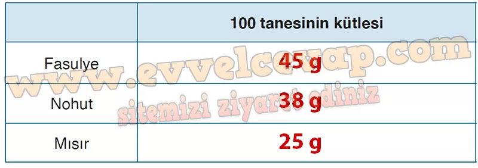
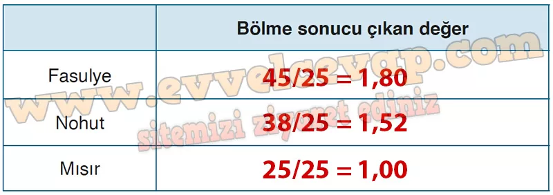
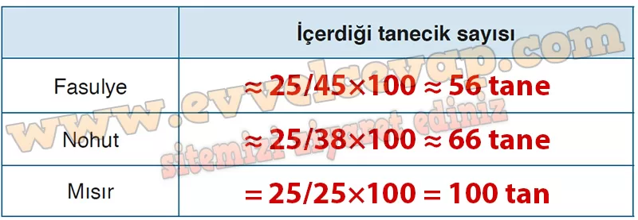
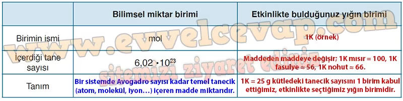

## 10. Sınıf Kimya Ders Kitabı Cevapları Meb Yayınları Sayfa 49

**Soru: 3) Fasulye, nohut ve mısır tanelerinden yüzer adet sayınız. Bardağın darasını aldıktan sonra taneleri tartınız. Tartım sonuçlarını aşağıdaki tabloya yazınız.**

**Soru: 4) Bu taneciklerden istediğiniz birinin toplam kütlesini birim kütle olarak belirleyiniz. Diğer taneciklerin 100 tanesinin kütlesini birim kütle olarak belirlediğiniz taneciğin kütlesine bölünüz. Bölme sonucu çıkan değerleri aşağıdaki tabloya yazınız.**

**Soru: 5) 4. adımda bulduğunuz değer kadar kütlede mısır, fasulye ve nohut tartınız. Tarttığınız miktardaki tanecikleri ayrı ayrı sayarak içerdiği tanecik sayısını aşağıdaki tabloya yazınız.**

**Soru: 6) Bulduğunuz bağıl kütledeki tanecik sayısını 1 ölçü olarak kabul ediniz ve bu ölçüye bir isim veriniz, isim verdiğiniz birimi kullanarak ölçtüğünüz diğer maddelerin miktarını ifade ediniz.**

* **Cevap**: Bu birimle: 100 fasulye (**1,80 K**), 100 nohut (**1,52 K**), 100 mısır (**1,00 K**). (Not: Değerler örnektir; sınıf ölçümlerine göre değişebilir.)

**Soru: 7) Mol, çift ve düzine gibi bilinen bir miktar birimidir ve maddenin belirli bir miktarındaki atom veya molekül sayısını belirlemeye yarar. Güvenilir kaynaklardan (.edu, .gov uzantılı siteler, makale, kitap vb.) mol kavramını ve tanımını araştırınız. Etkinlik sonucu bulduğunuz kendi standart biriminizin tanımı ile mol tanımını kıyaslayınız ve aşağıdaki tabloyu doldurunuz.**

**10. Sınıf Meb Yayınları Kimya Ders Kitabı Sayfa 49**