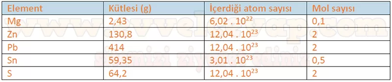

## 10. Sınıf Kimya Ders Kitabı Cevapları Meb Yayınları Sayfa 55

**Soru: 2) Aşağıdaki şekilde 108 g kütleye sahip bir gümüş metali gösterilmiştir. Bu metalin kütlesi yarıya düşürüldüğünde gümüş atomunun mol sayısı ile kütlesi arasındaki ilişkiyi belirten bir hipotez geliştiriniz. 1 mol 6,02 • 1023 tane Ag atomu içerir.**

108 g gümüş = 1 mol’dür. Eğer kütle yarıya düşerse (54 g), mol sayısı da yarıya düşer (0,5 mol).  
**Hipotez:** Bir metalin kütlesi azaldığında mol sayısı da kütle ile doğru orantılı olarak azalır.

**Soru: 3) 54 g gümüşün mol sayısı ile atom sayısı arasında nasıl bir dönüşüm vardır? Metalin mol sayısı ile içerdiği atom sayısı arasındaki ilişkiyi belirten bir hipotez yazınız.**

54 g gümüş = 0,5 mol’dür. 1 mol = 6,02·10²³ atom içerdiğinden, 0,5 mol = 3,01·10²³ atom içerir.  
**Hipotez:** Bir maddenin mol sayısı ile atom sayısı doğru orantılıdır; mol yarıya inerse atom sayısı da yarıya iner.

**Soru: 4) Aşağıdaki tabloda bazı elementlerin belirli miktarları verilmiştir. Görsel I ve Görsel IFden yararlanarak geliştirdiğiniz hipotezleri test ediniz ve tabloyu doldurunuz.**

**Soru: 5) Yukarıdaki temsilî görsele göre karbon dioksidin kütlesi hakkındaki düşüncelerinizi yazınız.**

* **Cevap**: Karbon dioksit (CO₂), 1 mol C (12 g) ve 2 mol O (2×16 g = 32 g) içerir. Bu yüzden 1 mol CO₂’nin kütlesi 44 g olur.

**Soru: Görseldeki terazide iki mol karbon dioksit olsaydı kütle nasıl değişirdi?**

* **Cevap**: Eğer 2 mol CO₂ olsaydı, kütle iki katına çıkar ve 88 g olurdu.

**10. Sınıf Meb Yayınları Kimya Ders Kitabı Sayfa 55**