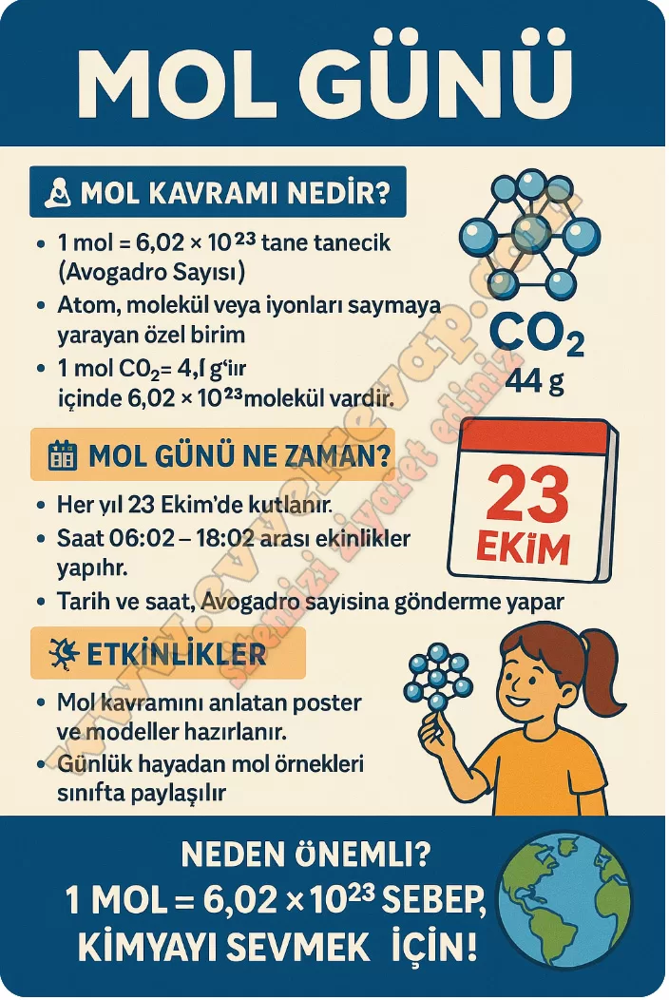

## 10. Sınıf Kimya Ders Kitabı Cevapları Meb Yayınları Sayfa 58

Avogadro veya Mol Günü, kimya alanındaki bir ölçüm birimi onuruna her sene 23 Ekim’de saat 6.02 ile 18.02 arasında kutlanmaktadır. Bunun nedeni; gün, ay ve saat biçiminde yazıldığında 6.02 ve 10/23 ifadelerinin Avogadro sayısındaki rakamları içermesidir. Avogadro Günü’nün amacı, insanları kimyaya ilgi duymaya teşvik etmektir.

**Soru: Yukarıdaki bilgiden yola çıkarak Mol Günü etkinlikleri kapsamında mol kavramı ile ilgili öğrenme sürecindeki düşüncelerinizi aşağıdaki alana yazarak sınıfta arkadaşlarınızla paylaşınız. Mol Günü kapsamında çeşitli afiş ve modellemeler hazırlayarak sınıfınızda sununuz.**

**10. Sınıf Meb Yayınları Kimya Ders Kitabı Sayfa 58**