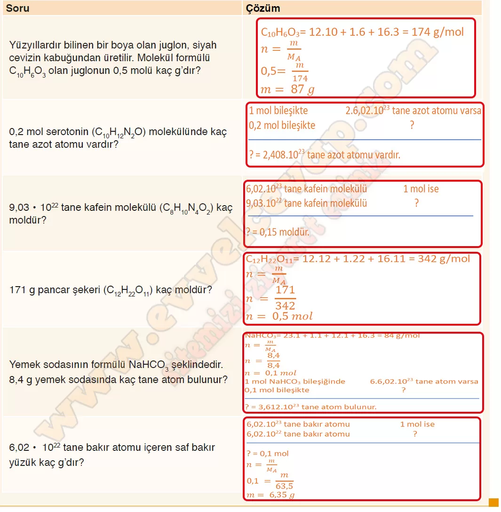

## 10. Sınıf Kimya Ders Kitabı Cevapları Meb Yayınları Sayfa 60

**Soru: 4)** Mol-kütle, mol-tanecik ve kütle-tanecik-mol ilişkilerine ait geçiş aşağıdaki gibidir:  
 • Bir maddenin gram cinsinden kütlesinin mol kütlesine oranı mol sayısını verir.  
 • Bir maddenin içerdiği tanecik sayısının Avogadro sayısına oranı mol sayısını verir.  
 • Bir maddenin gram cinsinden kütlesinin içerdiği tanecik sayısının mol kütlesinin içerdiği tanecik sayısına oranı mol sayısını verir. **Yukarıdaki bilgileri kullanarak maddenin ölçülebilir özelliklerine ilişkin aşağıdaki soruları cevaplayınız.**

**Soru: Yüzyıllardır bilinen bir boya olan juglon, siyah cevizin kabuğundan üretilir. Molekül formülü C10H6O3 olan juglonun 0,5 molü kaç g’dır?**

**Soru: 0,2 mol serotonin (C10H12N2O) molekülünde kaç tane azot atomu vardır?**

**Soru: 9,03 • 1022 tane kafein molekülü (C8H10N4O2) kaç moldür?**

**Soru: 171 g pancar şekeri (C12H12O11) kaç moldür?**

**Soru: Yemek sodasının formülü NaHC03 şeklindedir. 8,4 g yemek sodasında kaç tane atom bulunur?**

**Soru: 6,02 • 1022 tane bakır atomu içeren saf bakır yüzük kaç g’dır?**

 

**10. Sınıf Meb Yayınları Kimya Ders Kitabı Sayfa 60**