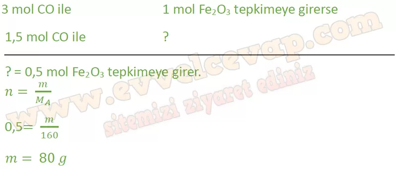

## 10. Sınıf Kimya Ders Kitabı Cevapları Meb Yayınları Sayfa 69

**Etkinlik**

**Adı**: Çelik Üretimindeki Kimyasal Hesaplamalar  
 **Amacı**: Kimyasal hesaplama yapabilme  
 **Süresi**: 40 dakika

**Soru: Aşağıdaki metni okuyunuz ve basamakları takip ederek etkinliği gerçekleştiriniz- Basamakları tamamladıktan sonra “Değerlendirme” bölümündeki soruları cevaplayınız.**

Çelik, demirin çeşitli elementlerle oluşturduğu bir alaşım türüdür. Çelik üretiminde Fe2Os bileşiği, bazen H2 ile bazen de CO ile indirgenerek Fe metali elde edilir. Fe203 bileşiğinin CO ile verdiği tepkime, şeklindedir. Denkleştirilmiş bu denklemden elde edilebilecek birçok bilgi vardır.

Örneğin çelik üretiminde kullanılan Fe203 bileşiği CO ile tepkimeye girdiğinde kaç g demir elde edilir? Bu tepkimede tepkimeye giren maddelerin ve tepkime sonucu oluşan ürünlerin kütleleri aşağıda verilmiştir:

**Tepkime ile ilgili verilen soruları cevaplayınız. (H: 1 g/mol, C: 12 g/mol, 0:16 g/mol, Fe: 56 g/mol)**

**Soru: 1) Yukarıdaki tepkimede verilen kütleleri inceleyiniz. Verilen kütlelerden mol sayıları hesaplandığında mol oranları ile tepkime katsayıları arasında nasıl bir ilişki olduğunu arkadaşlarınızla tartışınız.**

**Soru: 2) 2 mol Fe203 tamamen tepkimeye girdiğinde;**

**Soru: Kaç mol CO harcanır?**

**Soru: Kaç mol Fe oluşur?**

**Soru: Tepken ya da ürünlerin mol sayıları ile katsayıları arasındaki ilişkiyi açıklayınız.**

* **Cevap**: Her maddenin mol sayısı, denklemdeki katsayılarla **doğru orantılıdır**. Katsayılar, tepkimeye giren ve çıkan maddelerin mol oranlarını gösterir.

**Soru: 3) 1,5 mol CO tamamen tepkimeye girdiğinde;**

**Soru: Kaç g Fe203 harcanır?**

**Soru: Kaç g Fe oluşur?**

**Soru: Kaç g C02 oluşur?**

**Soru: Tepken ya da ürünler arasındaki stokiyometrik orana ilişkin çıkarımınızı yazınız. Bu çıkarıma nasıl ulaştığınızı açıklayınız.**

**✅Stokiyometrik çıkarım:** Tepkimeye giren ve çıkan maddelerin mol oranları, denklemdeki katsayılarla aynıdır. Yani kullanılan mol miktarı katsayılarla orantılı olarak diğer maddelerin mol ve kütle miktarlarını belirler.

**✅Açıklama:** Katsayılar sayesinde Fe₂O₃, CO, Fe ve CO₂ arasındaki miktar ilişkisi kolayca hesaplanabilir.

**Soru: 1 mol Fe elde etmek için kaç tane CO molekülü kullanılmalıdır?**

**10. Sınıf Meb Yayınları Kimya Ders Kitabı Sayfa 69**