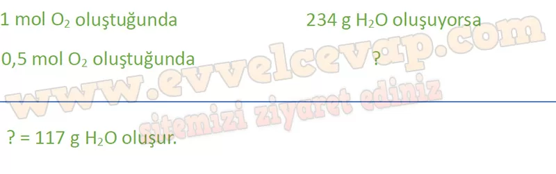
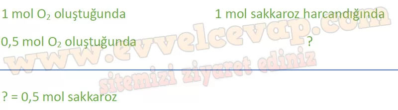
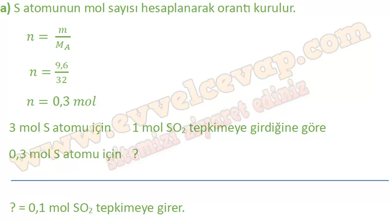
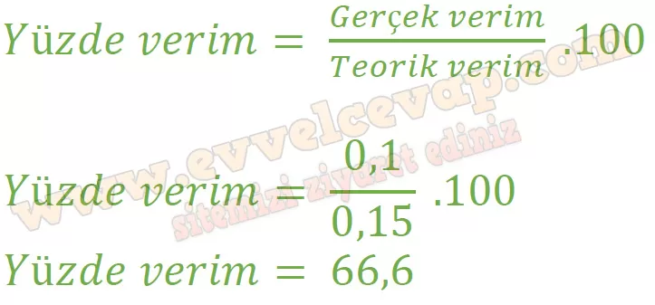

## 10. Sınıf Kimya Ders Kitabı Cevapları Meb Yayınları Sayfa 73

**Çalışma Yaprağı**

**Soru: Aşağıda verilen kimyasal denklemler ile ilgili soruları cevaplayınız.**

**Soru: 1. Sülfürik asit ve sakkaroz tepkimeye girdiğinde görseldeki gibi siyah, katı bir uzantı oluşur. Tepkime denklemi aşağıdaki gibidir: 2H2SO4) + C12H2P11 (k)→ 12C(k) + 13Hp(g) + 2S0(g) + 0(g) + ısı Buna göre 0,5 mol 02 oluştuğunda;**

**Soru: a) Kaç g su oluşur? (H: 1 g/mol, O: 16 g/mol)**

**Soru: b) Kaç mol sakkaroz harcanır?**

**Soru: 2) Doğal gaz içindeki hidrojen sülfür gazının uzaklaştırılması aşağıdaki tepkimede verildiği gibidir: 2H2S(g) + S0(g)→ 3S(k) + 2Hp(s) 0,2 mol SO2 gazının yeterince H2S ile tepkimesinden 9,6 g Selde edildiğine göre;**

**Soru: a) Kaç mol SO2 tepkimeye girmiştir? (S: 32 g/mol)**

**Soru: b) Tepkime verimi% kaçtır?**

**10. Sınıf Meb Yayınları Kimya Ders Kitabı Sayfa 73**