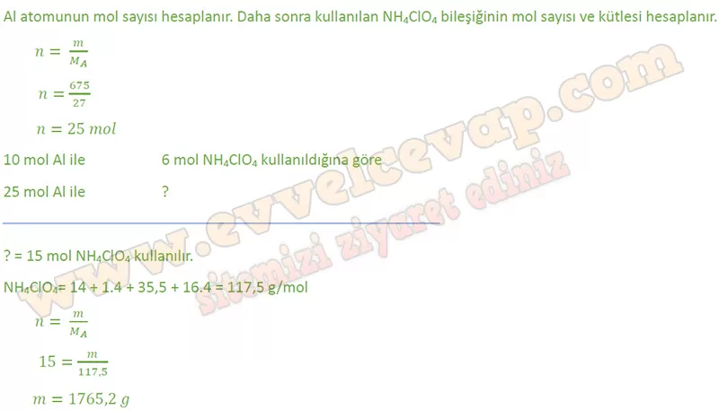
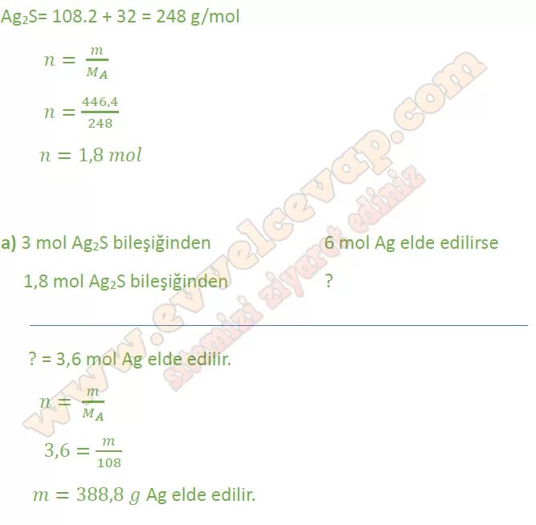
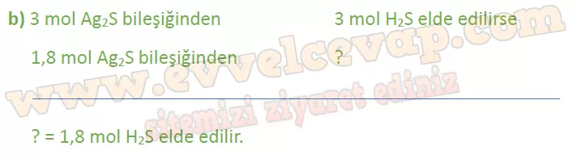
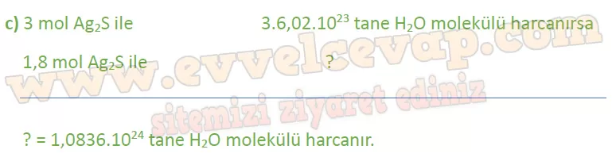

## 10. Sınıf Kimya Ders Kitabı Cevapları Meb Yayınları Sayfa 74

**Soru: 3) Uzay mekiğinin fırlatılması aşamasında amonyum perklorat (NH4CIO4) ve alüminyum tozu kullanılır. Ateşlemede meydana gelen tepkime aşağıdaki gibidir: 6NH4CI0(k) + 10Al(k)- 5AIPik) + 3N(g) + 6HCl(g) + 9Hp(g) Bu tepkimede 675 g Al için kaç g NH4ClO4 kullanılmalıdır?**

**Soru: 4)**Gümüşten yapılan eşyalar zamanla kararır. Bu, gümüşün görüntüsünü bozduğu için istenmeyen bir durumdur. Gümüş, havadaki sülfür ile tepkimeye girerek Ag2S bileşiğini oluşturur. Bu bileşik siyah renklidir. Ag2S bileşiğini uzaklaştırmanın birkaç yöntemi bulunmaktadır. Ovarak temizlemek bu seçeneklerden biri olsa da bu işlem gümüş miktarını zamanla azaltır. Diğer bir yöntem daha basit ve zahmetsizdir. Gümüşün kararan yüzeyini temizlemek için sıcak su ve alüminyum folyoya ihtiyaç vardır. Bu maddeler kararan gümüş ile bir kabın içinde bekletilirse gümüşün yüzeyinde oluşan Ag2S bileşiği kimyasal bir tepkime sonucu tekrar gümüş elementine dönüşür. **446,4 g Ag2S bileşiğinin tam verimle tepkimesinden;**

**Soru: a) Kaç g gümüş elde edilir? (S: 32 g/mol, Ag: 108 g/mol)**

**Soru: b) Kaç mol H2S oluşur?**

**Soru: c) Kaç tane H2O molekülü harcanır?**

**10. Sınıf Meb Yayınları Kimya Ders Kitabı Sayfa 74**