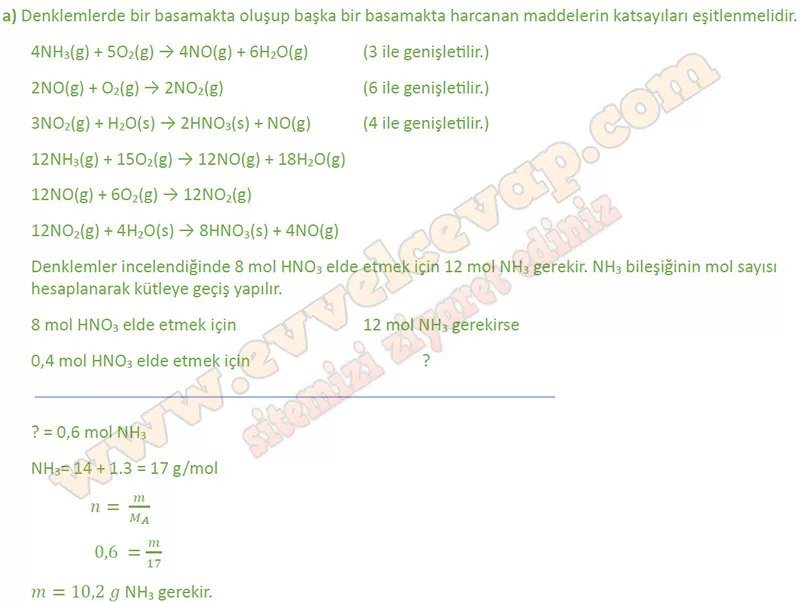
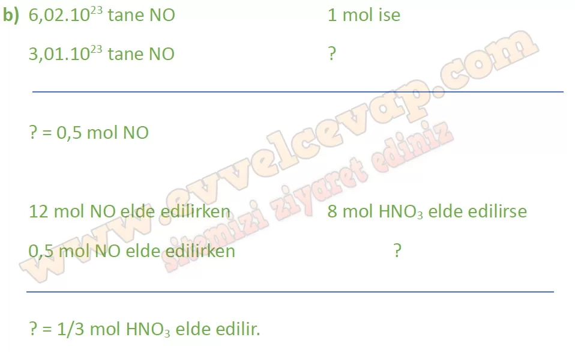
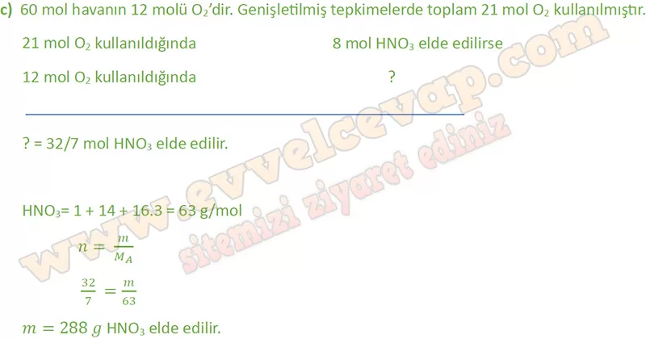
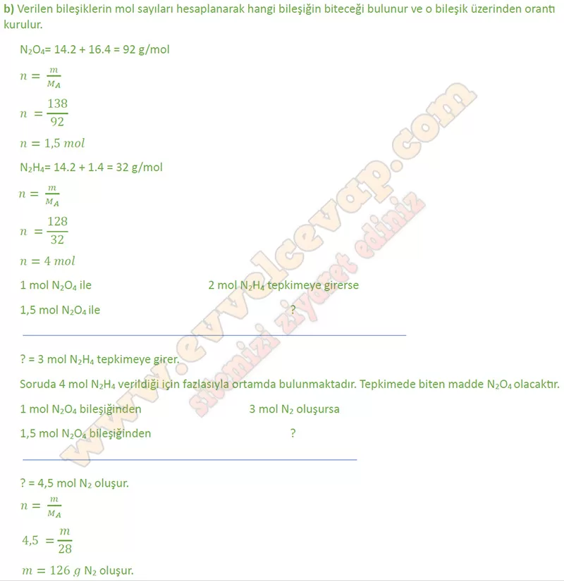

## 10. Sınıf Kimya Ders Kitabı Cevapları Meb Yayınları Sayfa 75

**Kontrol Noktası**

Ostwald (Osvalt) süreciyle nitrik asit üretimi için aşağıdaki adımların gerçekleştirilmesi gerekir:  
 İlk olarak oksijenle amonyak tepkimeye sokularak azot monoksit elde edilir. Bu tepkime 850 °C sıcaklık, 5 atm basınç ve platin ya da rodyum katalizörlüğünde gerçekleştirilir.  
 4NH3(g) + 502(g) 4N0(g) + 6H20(g)  
 Azot monoksidin oksijen ile tepkimeye girmesiyle azot dioksit elde edilir.  
 2N0(g) + 02(g) → 2N02(g)  
 Azot dioksidin su ile tepkimeye girmesiyle nitrik asit elde edilir.

**Soru: a) 0,4 mol HNO3 elde etmek için tepkime kaç g NH3 ile başlatılmalıdır? (H: 1 g/mol, N: 14 g/mol)**

**Soru: b) 3,01 -1023 tane NO gazı elde edildikten sonra kaç mol HNO3 elde edilebilir?**

**Soru: c) İşlem süresince toplam 60 mol hava kullanıldığına göre kaç g HNO3 elde edilmiştir? (Havanın yaklaşık %20’si oksijendir. H: 1 g/mol, N: 14 g/mol, O: 16 g/mol)**

**Soru: 2) Hidrazin (N2H4) ve diazot tetroksit (N204) karışımı roketlerde yakıt olarak kullanılır. Kapalı kapta N2H4 ve N204 tepkimesinin zamanla mol sayısı değişimi aşağıdaki grafikte verilmiştir: Buna göre**

**Soru: a) N2H4 ve N2O4 arasındaki denkleştirilmiş tepkime denklemini yazınız.**

* **Cevap**: **2N2H4 + N2O4 → 3N2 + 4H2O**

**Soru: b) 138 g N2O4 ile 128 g N2H4 tepkimesinden tam verimle elde edilen azot gazı kaç g’dır? (H: 1 g/mol, N: 14 g/mol, O: 16 g/mol)**

**Soru: c) Tepkime denklemini kullanarak b şıkkındaki sınırlayıcı bileşeni belirleyiniz.**

**10. Sınıf Meb Yayınları Kimya Ders Kitabı Sayfa 75**