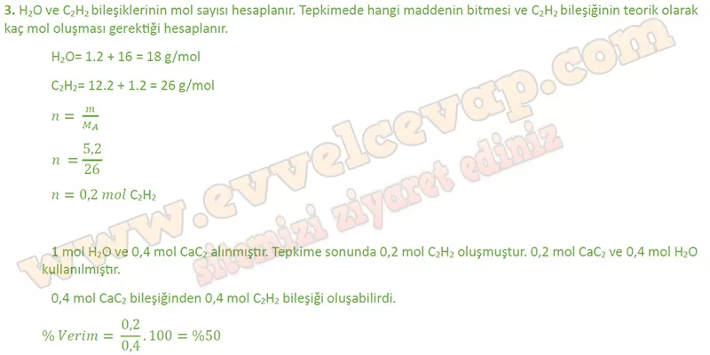
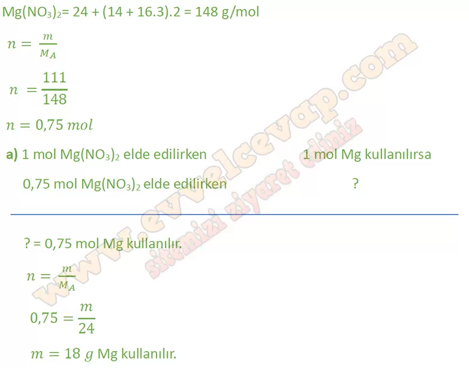
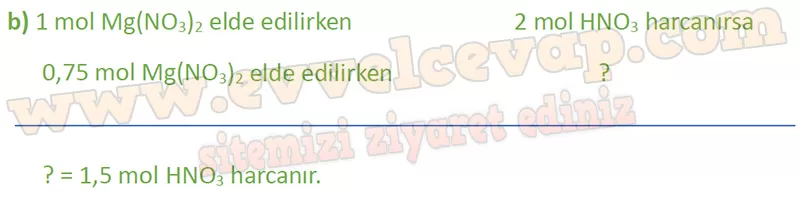
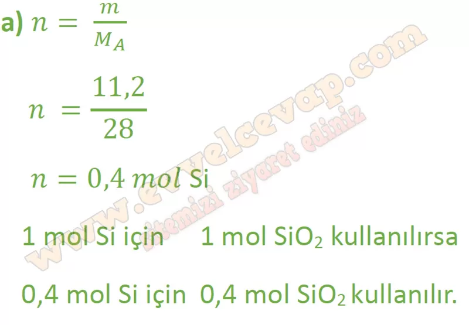
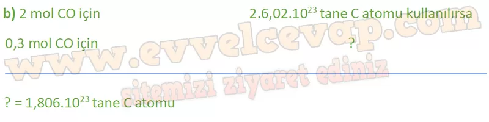

## 10. Sınıf Kimya Ders Kitabı Cevapları Meb Yayınları Sayfa 76

**Soru: 3) Kalsiyum karbürden (CaC2) asetilen gazı (C2H2) eldesine ait denklem aşağıda verilmiştir. CaC2(k) + 2H20(s) -► Ca(OH)2(k) + C2H2(g) 0,4 mol CaC2 ve 18 g su kullanılarak 5,2 g asetilen (C2H2) gazı elde ediliyor. Buna göre tepkimenin verimi % kaçtır? (H: 1 g/mol, C: 12 g/mol, O: 16 g/mol, Ca: 40 g/mol)**

**Soru: 4) Magnezyum elementi, periyodik cetvelin 2A grubunda bulunan bir metaldir. Bu metal, nitrik asitte çözünerek hidrojen gazı oluşturur. Bu olaya ait denklem, Mg(k) + 2HNO3(suda) —> Mg(NO3)2(suda) + H2(g) şeklindedir. Buna göre 111 g Mg(N03)2 elde etmek için;**

**Soru: a) Kaç g Mg harcanmıştır? (N: 14 g/mol, O: 16 g/mol, Mg: 24 g/mol)**

**Soru: b) Kaç mol nitrik asit harcanmıştır?**

**Soru: 5) Yüksek saflıktaki silisyum eldesi için 25 °C sıcaklıkta  
 Si02(k) + 2C(k) Si(k) + 2CO(g) tepkimesi kullanılır.  
 Bu tepkime ile ilgili aşağıda verilen soruları cevaplayınız.**

**Soru: a) 11,2 g Si elde etmek için kaç mol Si02 harcanmalıdır? (Si: 28 g/mol)**

**Soru: b) 0,3 mol CO gazı elde etmek için kaç tane C atomu harcanmalıdır?**

**10. Sınıf Meb Yayınları Kimya Ders Kitabı Sayfa 76**