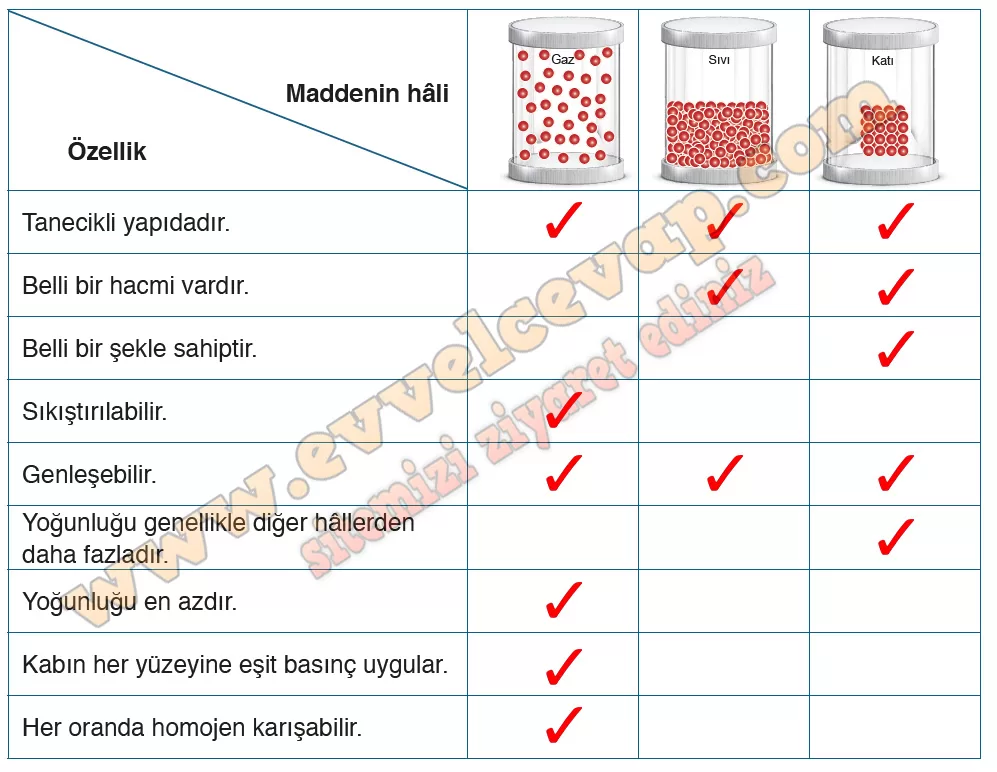

## 10. Sınıf Kimya Ders Kitabı Cevapları Meb Yayınları Sayfa 78

**Etkinlik**

**Adı**: Çok Farklıyız  
 **Amacı**: Bilişim teknolojilerinden yararlanarak gazların genel özelliklerini gözlemleyebilme  
 **Süresi**: 40 dakika  
 Bu etkinliğe ilişkin değerlendirme, kitabın sonunda yer alan “Ekler” bölümündeki 6 ve 7. form ile öğrenci tarafından, 8. form ile öğretmen tarafından yapılacaktır.

**Soru: Öğretmeniniz gözetiminde 4-6 kişilik gruplara ayrılınız ve aşağıdaki basamakları takip ederek etkinliği gerçekleştiriniz. Basamakları tamamladıktan sonra “Değerlendirme” bölümündeki soruları cevaplayınız.**

**Soru: 1) Aşağıda maddenin katı, sıvı ve gaz hâllerinin sahip olduğu bazı özelliklerle ilgili ifadeler verilmiştir. Katı, sıvı ve gazların özelliklerine uygun ifadelere “✓” işareti koyarak tabloyu tamamlayınız. Tabloyu tamamladıktan sonra gazların katı ve sıvılardan farklı olan özelliklerinin nedenlerini grup arkadaşlarınızla tartışınız.**

**Soru: 2) Karekodda verilen bağlantıya giriş yapınız. Açılan ekrandan “Giriş ” sekmesine tıklayınız. Simülasyonu çalıştırdıktan sonra sağ üst köşedeki genişlik, kronometre ve çarpışma sayacını işaretleyerek aktif hâle getiriniz. Gazların özelliklerini belirleyebilmek için grup arkadaşlarınızla simülasyonda neler yapmanız gerektiğini içeren bir plan oluşturarak görev dağılımı yapınız.**

* **Cevap**: Simülasyonda gazların hareketlerini görmek için tanecik sayısı değiştirilmeli, hacim küçültülüp büyütülmeli ve sıcaklık etkisi incelenmelidir. Grup üyeleri görev paylaşarak gözlem yapar.

**Soru: 3) Simülasyonun sağ tarafında yer alan “Tanecikler ”sekmesini kullanarak kabın içerisine mavi taneciklerden bir miktar gönderiniz. Tanecik sayısı arttıkça çarpışma sayacındaki değişiklikleri gözlemleyiniz. Basıncın gaz taneciklerinin hangi davranışı sonucunda oluştuğunu grup arkadaşlarınızla tartışınız. Tartışma sonucu ulaştığınız ortak fikirleri yazınız.**

* **Cevap**: anecik sayısı arttıkça çarpışmalar arttı. Basınç, taneciklerin kabın çeperine çarpmasıyla oluşur.

**10. Sınıf Meb Yayınları Kimya Ders Kitabı Sayfa 78**