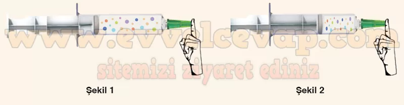

## 10. Sınıf Kimya Ders Kitabı Cevapları Meb Yayınları Sayfa 82

**Kontrol Noktası**

**Soru: 1) Görseldeki kabın içerisinde belirli bir sıcaklıkta, eşit mol sayısında Ne ve He gazı vardır. Kaplar arasındaki musluk açılıp yeterli süre bekleniyor. Buna göre;**

**Soru: a) Gazların basınç, hacim, yoğunluk değişkenlerinden hangisi veya hangileri değişir? Nedenini açıklayınız.**

* **Cevap**: Gazlar iki kaba da homojen olarak yayılacaktır. Böylece hacimleri artar, yoğunlukları ve basınçları azalır.

**Soru: b) Boş bölmeye hangi gaz ya da gazlar gider? Çizerek açıklayınız.**

* **Cevap**: Yeterli süre sonunda her iki kaba da gazlar homojen olarak dağılacaktır. Gazlar birbirleriyle her oranda homojen olarak karışır.

**Soru: c) Musluk açılıp yeteri kadar bekletildiğinde her iki bölmedeki gaz basıncını, gaz miktarını kapların son durumlarını çizerek kıyaslayınız.**

* **Cevap**: Birim hacimdeki tanecik sayısı azalacağı için kabın duvarına yapılan kuvvet de (basınç) azalacaktır. İlk duruma göre 3L’lik kaptaki gaz miktarı azalır ve ilk duruma göre 3L’lik kabın basıncı azalır. Son durumda her iki kabın da basıncı eşit olur. Toplam madde miktarı değişmez. Birim hacimdeki madde miktarı azalır.

**Soru: 2) Oda şartlarında eşit mol sayısına sahip C02, He ve H2 gazları ile üç ayrı balon doldurulmuştur. Balonların hacimlerine ilişkin düşüncelerinizi yazınız.**

* **Cevap**: Mol sayıları aynı olduğu için hacimleri eşit olacaktır.

**Soru: 3) Hava ile dolu bir şırınganın ucu Şekil 1 ’de gösterildiği gibi kapatılmıştır ve piston ileri doğru itilerek Şekil 2’deki hâle getirilmiştir.**

**Soru: a) Bu itme sonucu havayı oluşturan taneciklerin dağılımını Şekil 2 üzerinde çizerek açıklayınız.**

* **Cevap**: Gaz tanecikleri sıkışacaktır.

**Soru: b) Piston sonuna kadar ittirilebilir mi? Neden?**

* **Cevap**: Hayır. Gaz tamamen sıfır hacme sıkıştırılamaz; hacim azaldıkça basınç çok artar ve piston/şırınga sınırları nedeniyle sonuna kadar itilmez.

**10. Sınıf Meb Yayınları Kimya Ders Kitabı Sayfa 82**