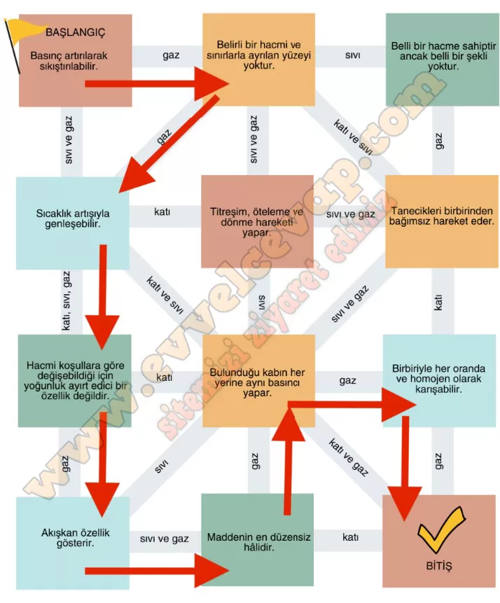

## 10. Sınıf Kimya Ders Kitabı Cevapları Meb Yayınları Sayfa 83

**Çalışma Yaprağı**

Aşağıda maddenin katı, sıvı ve gaz hâline ait özellikler kutucuklara yazılmıştır.

**Soru: a) Kutucuklarda verilen özellikler maddenin hangi hâline ait ise o yönde ilerleyerek çıkışa ulaşınız (Kutular arası aynı geçiş yolunu bir kez kullanınız.).**

**Soru: b) Kutucuklarda verilen özelliklerden sadece gazlara ait olanları yazınız.**

* **Cevap**: Basınç artırılarak sıkıştırılabilir. Belirli bir hacmi ve sınırla ayrılan yüzeyi yoktur. Bulunduğu kabın her yerine aynı basıncı yapar. Tanecikleri birbirinden bağımsız hareket eder. Hacmi koşullara göre değiştiği için yoğunluk ayırt edici bir özellik değildir. Birbiriyle her oranda ve homojen olarak karışabilir. Maddenin en düzensiz hâlidir.

**10. Sınıf Meb Yayınları Kimya Ders Kitabı Sayfa 83**