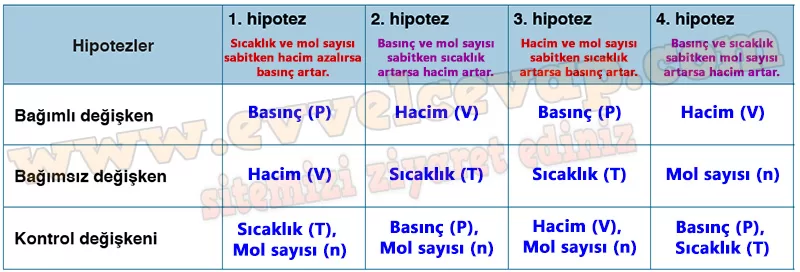

## 10. Sınıf Kimya Ders Kitabı Cevapları Meb Yayınları Sayfa 86

**Soru: 1) Pistonlu ve gaz türbinli motorların çalışması sırasında gazların hangi özelliklerinde değişimler meydana geldiğini tartışınız. Her bir arkadaşınızın fikrinin değerli olduğunu göz önüne alarak tüm fikirleri dikkatlice dinleyiniz ve ortak kararlar veriniz. Değişkenler arasındaki ilişkiyi ar aştırabileceğiniz, örnekte verilene benzer araştırma soruları yazınız.**

* **Cevap**: Sıkışma-genleşme ve yanma boyunca P, V, T ve n değişir; kompresörde P↑, V↓; yanma odasında T↑, P≈yüksek; egzozda P↓ olur. Örnek sorular: “Hacim yarıya inince basınç nasıl değişir?”, “Sıcaklık iki kat olursa sabit hacimde basınç ne olur?”, “Mole sayısı artınca sabit P,T’de hacim nasıl değişir?”, “Kompresör oranı ↑ olunca türbin itişi nasıl etkilenir?”

**Soru: 2) Gaz basıncını katı ve sıvıların basıncı ile nasıl ilişkilendirebilirsiniz? Kısaca açıklayınız.**

* **Cevap**: Tüm hâllerde basınç, yüzeye etkiyen kuvvetten doğar; gazlarda çeper çarpışmalarıyla, sıvılarda derinlik/yoğunlukla, katılarda ağırlık/yüzey alanıyla belirlenir. Gazlar çok sıkıştırılabilir ve kabın her yerine eşit P uygular; sıvı/katılarda sıkıştırılabilirlik çok azdır.

**Soru: 3) Araştırma sorularından yola çıkarak basınç-hacim, sıcaklık-hacim, sıcaklık-basınç ve madde miktarı-hacim değişkenleri arasındaki ilişkiye dayanan dört farklı hipotez oluşturunuz.**

(Boyle) Sıcaklık ve n sabitken V↓ → P↑ (P ∝ 1/V).

(Charles) Basınç ve n sabitken T↑ → V↑ (V ∝ T).

(Gay-Lussac) Hacim ve n sabitken T↑ → P↑ (P ∝ T).

(Avogadro) P ve T sabitken n↑ → V↑ (V ∝ n).

**Soru: 4) Her bir hipotez için bağımlı değişken, bağımsız değişken ve kontrol değişkenlerini belirleyiniz. Bu değişkenleri aşağıdaki tabloya yazınız.**

**Soru: 5) Karekodda verilen bağlantıya giriş yapınız ve “Kanunlar ” sekmesini tıklayınız.**

* **Cevap**: Kanunlar sekmesinde Boyle, Charles, Gay-Lussac ve Avogadro yasalarının yer aldığı görülür.

**Soru: 6) Hipotezinizi test etmek için grup arkadaşlarınızla beraber simülasyonda neler yapmanız gerektiğini içeren bir plan oluşturunuz. Planınızı hazırlarken tüm arkadaşlarınızın fikrini alarak ortak bir plan oluşturunuz ve planın aşamalarını yazınız.**

* **Cevap**: Önce bağımsız değişken seçilir (hacim, sıcaklık, basınç ya da mol sayısı). Daha sonra diğer değişkenler sabit tutulur. Simülasyonda adım adım değiştirilerek bağımlı değişkenin tepkisi gözlenir ve sonuçlar tabloya kaydedilir.

**Soru: 7) Simülasyon esnasında bağımsız değişkenin bağımlı değişken üzerindeki etkisini kaydediniz.**

* **Cevap**: Örneğin hacim küçültülünce basınç arttı; sıcaklık artırılınca hacim büyüdü; sıcaklık artınca basınç da yükseldi; mol sayısı artınca hacim genişledi.

**10. Sınıf Meb Yayınları Kimya Ders Kitabı Sayfa 86**