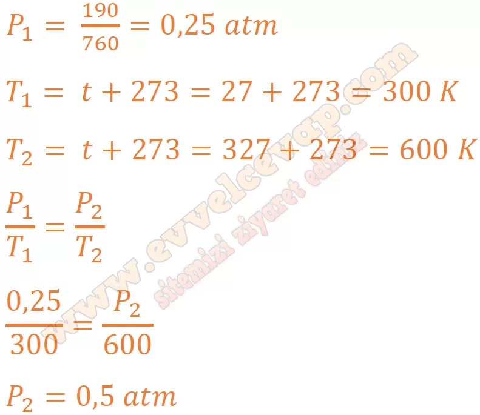
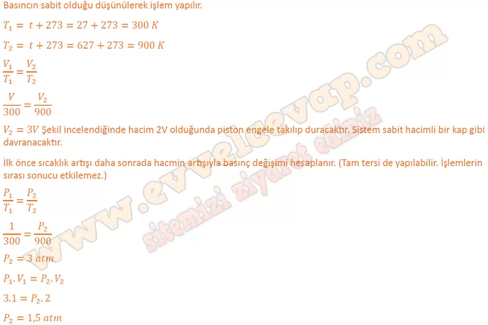

## 10. Sınıf Kimya Ders Kitabı Cevapları Meb Yayınları Sayfa 95

**Kontrol Noktası**

**Soru: 1)** Eski tip akkor ampullerde ısıtıldığında ışık üreten filaman adında tungstenden yapılmış ince bir tel bulunur. Filamanın yanmaması için oksijensiz ve yalıtılmış bir ampul içerisine yerleştirilmesi gerekir. Böylece ısıtıldığında ışık yaymaya başlar. Tungsten atomları, yüksek sıcaklığa maruz kaldığında buharlaşır. Yalıtılmış ampul içerisinde buhar artarsa filaman parçalanır ve cam kararır. Bu sorunu ortadan kaldınjıak için argon gazı kullanılır. Bir miktar argon gazı konulmuş bir akkor ampul 27 °C sıcacığındadır. **Başlangıçta argon gazının basıncı 190 mmHg olduğuna göre ampul 327 °C sıcaklığa çıktığında basınç kaç atm olur?**

**Soru: 2) Şekildeki sistemde bir miktar H2 gazı bulunmaktadır. Deniz seviyesinde bulunan bu sistem 27 °C sıcaklığındadır. Pistonlu kap 627 °C sıcaklığa kadar ısıtıldığında kabın son basıncı kaç atm olur?**

**Soru: 3) Mısır ısıtılınca patlayarak açılır. Bu esnada içerisindeki nişastanın da dışarı çıkmasıyla beyaz renkli bir görünüm alır. Yukarıdaki grafikte mısır tanelerinin sıcaklıkla ilişkisi gösterilmiştir. Mısırın patlamasını hangi gaz yasası ile açıklayabilirsiniz?**

* **Cevap**: Gay-Lussac kanunu.

**10. Sınıf Meb Yayınları Kimya Ders Kitabı Sayfa 95**