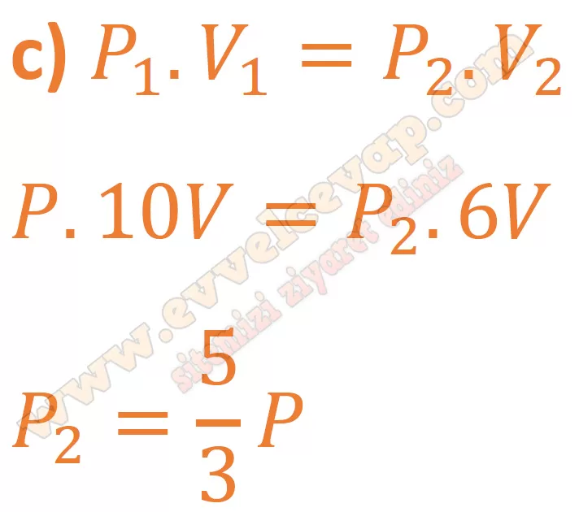

## 10. Sınıf Kimya Ders Kitabı Cevapları Meb Yayınları Sayfa 96

**Soru: 4) Hiperbarik oksijen tedavisi (HBOT), 1 atm basınçtan daha büyük bir basınç içeren odada saf oksijen solunmasına dayanan bir tedavi yöntemidir. Bu yöntemle yanıklar, kan akışını engelleyen ezilmeli yaralanmalar, kan damarlarındaki hava embolisi, karbon monoksit zehirlenmesi ve vurgun gibi rahatsızlıklar tedavi edilebilir. Dekompresyon (vurgun) olan dalgıçların dokularında biriken gaz kabarcıklarının HBOT yöntemi ile yok edilmesinde hangi gaz yasasından yararlanılır? Açıklayınız.**

**Soru: 5) Gazlar bulundukları kabın hacmini alır. Bu nedenle gazların hacmi bulundukları şartlardan etkilenir. Doğal gazın standart m3 hacmi, 15 °C ve 1,01325 bar basınç değerinde hesaplanır. Bundan dolayı doğal gaz faturalarında düzeltme katsayısı kullanılır. Sayaçta okunan değer düzeltme katsayısı ile çarpılarak gerçek hacim değeri hesaplanır. Düzeltme katsayısı il ve aylara göre değişiklik gösterir.**

**Soru: a) Düzeltme katsayısının 1 ’den büyük olduğu bir faturada, doğal gaz sayacının bulunduğu ortamı 15 °C sıcaklığına göre kıyaslayınız.**

* **Cevap**: Sıcaklık 15 oC değerinden daha küçüktür. Çünkü gaz hacmi gerçek hacminden daha küçük olduğunda düzeltme katsayısı 1’den büyük olur.

**Soru: b) İzmir’de ocak ve temmuz aylarında aynı doğal gaz sayacından eşit hacimde doğal gaz ölçülmüştür. Hangi ayda ölçülen değerin gerçek değere yakın olmasını beklersiniz? Açıklayınız.**

* **Cevap**: Gaz ısındıkça genleşeceği için gerçek değere en yakın ölçüm ocak ayındakidir.

**Soru: 6) İdeal sürtünmesiz pistonlu kapta bir miktar gaz bulunmaktadır. Aşağıdaki işlemler ayrı ayrı uygulandığında kap içerisindeki gazın basıncı nasıl değişir?**

**a) Piston sabitken mutlak sıcaklığı üç katına çıkarmak**

* **Cevap**: Piston sabitken hacim sabittir. Mutlak sıcaklık ile basınç doğru orantılı olduğu için (hacim ve mol sayısı sabitken) mutlak sıcaklık 3 katına çıkarsa basınç da 3 katına çıkar.

**b) Piston sabitken gaz miktarını yarıya indirmek**

* **Cevap**: Piston sabitken hacim sabittir. Madde miktarı ile basınç doğru orantılı olduğu için (hacim ve sıcaklık sabitken) madde miktarı yarıya inerse basınç da yarıya iner.

**c) Sabit sıcaklıkta hacmi %40 azaltacak şekilde pistonu aşağı itmek**

**ç) Hacim üç katına çıkana kadar pistonu yukarı çekmek**

* **Cevap**: Sıcaklık ve madde miktarı sabitken hacim artarsa basınç azalır. Hacim üç katına çıkarsa basınç 3 kat azalır.

**10. Sınıf Meb Yayınları Kimya Ders Kitabı Sayfa 96**