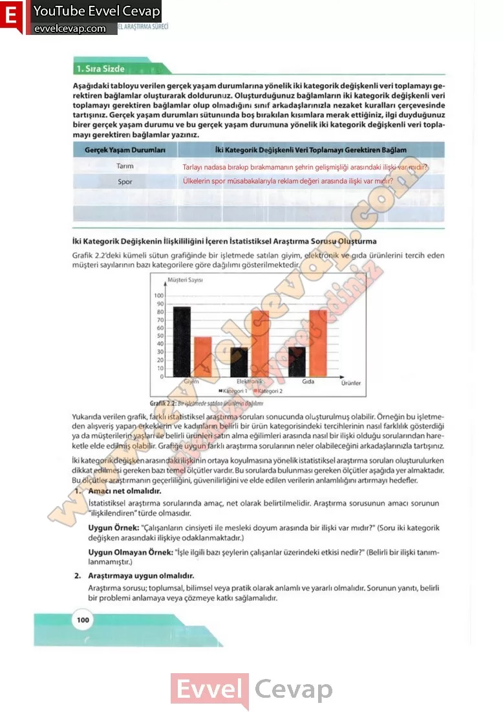

## 10. Sınıf Matematik Ders Kitabı Cevapları Meb Yayınları Sayfa 100

**1. Sıra Sizde**

**Soru: Aşağıdaki tabloyu verilen gerçek yaşam durumlarına yönelik iki kategorik değişkenli veri toplamayı gerektiren bağlamlar oluşturarak doldurunuz. Oluşturduğunuz bağlamların iki kategorik değişkenli veri toplamayı gerektiren bağlamlar olup olmadığına sınıf arkadaşlarınızla nezaket kuralları çerçevesinde tartışınız. Gerçek yaşam durumları sütununda boş bırakılan kısımlara merak ettiğiniz, ilgi duyduğunuz birer gerçek yaşam durumu ve bu gerçek yaşam durumuna yönelik iki kategorik değişkenli veri toplamayı gerektiren bağlamlar yazınız.**

İki Kategorik Değişkenin İiişldliiiğini İçeren İstatistiksel Araştırma Sorusu Oluşturma  
 Grafik 2.2’deki kümeli sütun grafiğinde bir işletmede satılan giyim, elektronik ve gıda ürünlerini tercih eden müşteri sayılarının bazı kategorilere göre dağılımı gösterilmektedir.

Yukarıda verilen grafik, farklı istatistiksel araştırma soruları sonucunda oluşturulmuş olabilir. Örneğin bu işletmeden alışveriş yapan erkeklerin ve kadınların belirli bir ürün kategorisindeki tercihlerinin nasıl farklılık gösterdiği ya da müşterilerin yaşları ile belirli ürünleri satın alma eğilimleri arasında nasıl bir ilişki olduğu sorularından hareketle elde edilmiş olabilir. Grafiğe uygun farklı araştırma sorularının neler olabileceğini arkadaşlarınızla tartışınız.  
 İki kategorik değişken arasındaki ilişkinin ortaya koyulmasına yönelik istatistiksel araştırma soruları oluşturulurken dikkat edilmesi gereken bazı temel ölçütler vardır. Bu sorularda bulunması gereken ölçütler aşağıda yer almaktadır. Bu ölçütler araştırmanın geçerliliğini, güvenilirliğini ve elde edilen verilerin anlamlılığını artırmayı hedefler.  
 1. Amacı net olmalıdır.  
 İstatistiksel araştırma sorularında amaç, net olarak belirtilmelidir. Araştırma sorusunun amacı sorunun “ilişkilendiren”türde olmasıdır.  
 Uygun Örnek: “Çalışanların cinsiyeti ile mesleki doyum arasında bir ilişki var mıdır?” (Soru iki kategorik değişken arasındaki ilişkiye odaklanmaktadır.)  
 Uygun Olmayan Örnek: “İşle ilgili bazı şeylerin çalışanlar üzerindeki etkisi nedir?” (Belirli bir ilişki tanım- lanmamıştır.)  
 2. Araştırmaya uygun olmalıdır.  
 Araştırma sorusu; toplumsal, bilimsel veya pratik olarak anlamlı ve yararlı olmalıdır. Sorunun yanıtı, belirli bir problemi anlamaya veya çözmeye katkı sağlamalıdır.

**10. Sınıf Meb Yayınları Matematik Ders Kitabı Sayfa 100**