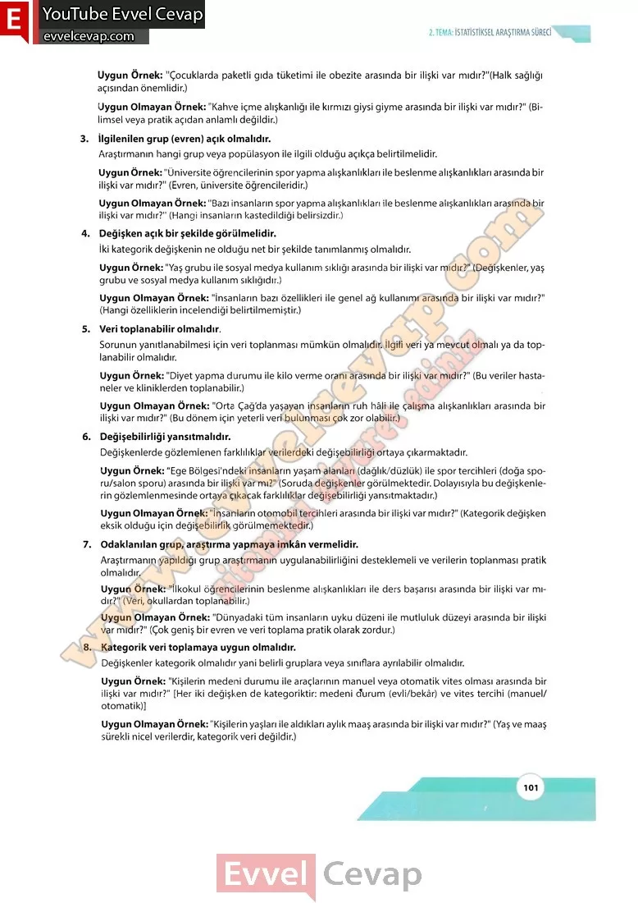

## 10. Sınıf Matematik Ders Kitabı Cevapları Meb Yayınları Sayfa 101

Uygun Örnek: “Çocuklarda paketli gıda tüketimi ile obezite arasında bir ilişki var mıdır?”(Halk sağlığı açısından önemlidir.)  
 Uygun Olmayan Örnek: “Kahve içme alışkanlığı ile kırmızı giysi giyme arasında bir ilişki var mıdır?” (Bilimsel veya pratik açıdan anlamlı değildir.)  
 3. İlgilenilen grup (evren) açık olmalıdır.  
 Araştırmanın hangi grup veya popülasyon ile ilgili olduğu açıkça belirtilmelidir.  
 Uygun Örnek: “Üniversite öğrencilerinin spor yapma alışkanlıkları ile beslenme alışkanlıkları arasında bir ilişki var mıdır?” (Evren, üniversite öğrencileridir.)  
 Uygun Olmayan Örnek: “Bazı insanların spor yapma alışkanlıkları ile beslenme alışkanlıkları arasında bir ilişki var mıdır?” (Hangi insanların kastedildiği belirsizdir.)  
 4. Değişken açık bir şekilde görülmelidir.  
 İki kategorik değişkenin ne olduğu net bir şekilde tanımlanmış olmalıdır.  
 Uygun Örnek: “Yaş grubu ile sosyal medya kullanım sıklığı arasında bir ilişki var mıdır?” (Değişkenler, yaş grubu ve sosyal medya kullanım sıklığıdır.)  
 Uygun Olmayan Örnek: “İnsanların bazı özellikleri ile genel ağ kullanımı arasında bir ilişki var mıdır?” (Hangi özelliklerin incelendiği belirtilmemiştir.)  
 5. Veri toplanabilir olmalıdır.  
 Sorunun yanıtlanabilmesi için veri toplanması mümkün olmalıdır. İlgili veri ya mevcut olmalı ya da toplanabilir olmalıdır.  
 Uygun Örnek: “Diyet yapma durumu ile kilo verme oranı arasında bir ilişki var mıdır?” (Bu veriler hastaneler ve kliniklerden toplanabilir.)  
 Uygun Olmayan Örnek: “Orta Çağ’da yaşayan insanların ruh hâli ile çalışma alışkanlıkları arasında bir ilişki var mıdır?” (Bu dönem için yeterli veri bulunması çok zor olabilir.)  
 6. Değişebilirliği yansıtmalıdır.  
 Değişkenlerde gözlemlenen farklılıklar verilerdeki değişebilirliği ortaya çıkarmaktadır.  
 Uygun Örnek: “Ege Bölgesi’ndeki insanların yaşam alanları (dağlık/düzlük) ile spor tercihleri (doğa spo- ru/salon sporu) arasında bir ilişki var mı?” (Soruda değişkenler görülmektedir. Dolayısıyla bu değişkenlerin gözlemlenmesinde ortaya çıkacak farklılıklar değişebilirliği yansıtmaktadır.)  
 Uygun Olmayan Örnek: “İnsanların otomobil tercihleri arasında bir ilişki var mıdır?” (Kategorik değişken eksik olduğu için değişebilirlik görülmemektedir.)  
 7. Odaklanılan grup, araştırma yapmaya imkân vermelidir.  
 Araştırmanın yapıldığı grup araştırmanın uygulanabilirliğini desteklemeli ve verilerin toplanması pratik olmalıdır.  
 Uygun Örnek: “İlkokul öğrencilerinin beslenme alışkanlıkları ile ders başarısı arasında bir ilişki var mıdır?” (Veri, okullardan toplanabilir.)  
 Uygun Olmayan Örnek: “Dünyadaki tüm insanların uyku düzeni ile mutluluk düzeyi arasında bir ilişki var mıdır?” (Çok geniş bir evren ve veri toplama pratik olarak zordur.)  
 8. Kategorik veri toplamaya uygun olmalıdır.  
 Değişkenler kategorik olmalıdır yani belirli gruplara veya sınıflara ayrılabilir olmalıdır.  
 Uygun Örnek: “Kişilerin medeni durumu ile araçlarının manuel veya otomatik vites olması arasında bir ilişki var mıdır?” [Her iki değişken de kategoriktir: medeni durum (evli/bekâr) ve vites tercihi (manuel/ otomatik)]  
 Uygun Olmayan Örnek: “Kişilerin yaşları ile aldıkları aylık maaş arasında bir ilişki var mıdır?” (Yaş ve maaş sürekli nicel verilerdir, kategorik veri değildir.)

* **Cevap**: **Bu sayfada soru bulunmamaktadır.**

**10. Sınıf Meb Yayınları Matematik Ders Kitabı Sayfa 101**