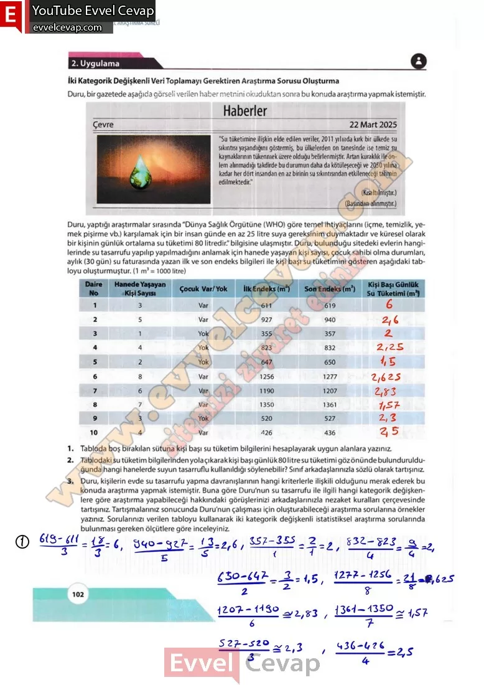
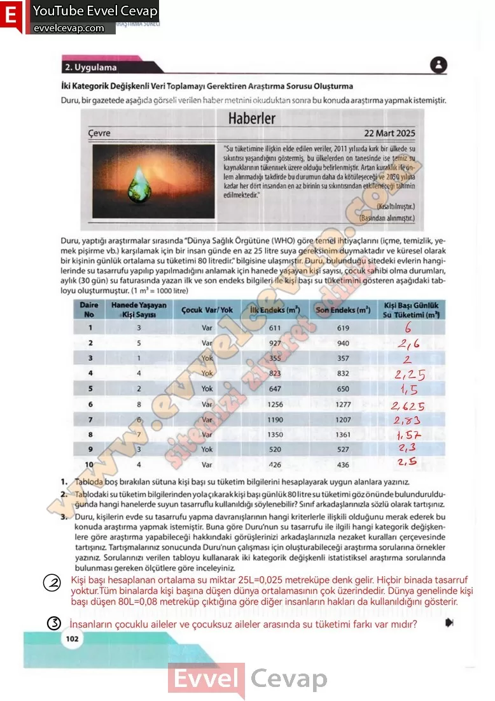

## 10. Sınıf Matematik Ders Kitabı Cevapları Meb Yayınları Sayfa 102

**2. Uygulama**

**İki Kategorik Değişkenli Veri Toplamayı Gerektiren Araştırma Sorusu Oluşturma**

Duru, bir gazetede aşağıda görseli verilen haber metnini okuduktan sonra bu konuda araştırma yapmak istemiştir. Duru, yaptığı araştırmalar sırasında “Dünya Sağlık Örgütüne (WHO) göre temel ihtiyaçlarını (içme, temizlik, yemek pişirme vb.) karşılamak için bir insan günde en az 25 litre suya gereksinim duymaktadır ve küresel olarak bir kişinin günlük ortalama su tüketimi 80 litredir.” bilgisine ulaşmıştır. Duru, bulunduğu sitedeki evlerin hangilerinde su tasarrufu yapılıp yapılmadığını anlamak için hanede yaşayan kişi sayısı, çocuk sahibi olma durumları, aylık (30 gün) su faturasında yazan ilk ve son endeks bilgileri ile kişi başı su tüketimini gösteren aşağıdaki tabloyu oluşturmuştur. (1 m3 = 1000 litre)

**Soru: 1) Tabloda boş bırakılan sütuna kişi başı su tüketim bilgilerini hesaplayarak uygun alanlara yazınız.**

**Soru: 2) Tablodaki su tüketim bilgilerinden yola çıkarak kişi başı günlük 80 litre su tüketimi göz önünde bulundurulduğunda hangi hanelerde suyun tasarruflu kullanıldığı söylenebilir? Sınıf arkadaşlarınızla sözlü olarak tartışınız.**

**Soru: 3)** Duru, kişilerin evde su tasarrufu yapma davranışlarının hangi kriterlerle ilişkili olduğunu merak ederek bu konuda araştırma yapmak istemiştir. Buna göre Duru’nun su tasarrufu ile ilgili hangi kategorik değişkenlere göre araştırma yapabileceği hakkındaki görüşlerinizi arkadaşlarınızla nezaket kuralları çerçevesinde tartışınız. Tartışmalarınız sonucunda Duru’nun çalışması için oluşturabileceği araştırma sorularına örnekler yazınız. **Sorularınızı verilen tabloyu kullanarak iki kategorik değişkenli istatistiksel araştırma sorularında bulunması gereken ölçütlere göre inceleyiniz.**

  
 

**10. Sınıf Meb Yayınları Matematik Ders Kitabı Sayfa 102**