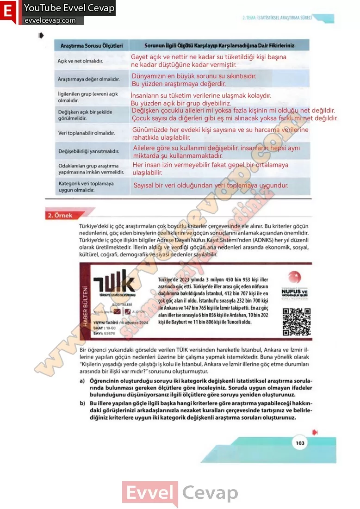

## 10. Sınıf Matematik Ders Kitabı Cevapları Meb Yayınları Sayfa 103

Açık ve net olmalıdır.  
 Araştırmaya değer olmalıdır.  
 İlgilenilen grup (evren) açık olmalıdır.  
 Değişken açık bir şekilde görülmelidir.  
 Veri toplanabilir olmalıdır.  
 Değişebilirliği yansıtmalıdır.  
 Odaklanılan grup araştırma yapılmasına imkân vermelidir.  
 Kategorik veri toplamaya uygun olmalıdır.

Türkiye’deki iç göç araştırmaları çok boyutlu kriterler çerçevesinde ele alınır. Bu kriterler göçün nedenlerini, göç eden bireylerin özelliklerini ve göçün sonuçlarını anlamak açısından önemlidir. Türkiye’de iç göçe ilişkin bilgiler Adrese Dayalı Nüfus Kayıt Sistemi’nden (ADNKS) her yıl düzenli olarak üretilmektedir. İllerin aldığı ve verdiği göçün ana nedenleri arasında ekonomik, sosyal, kültürel, coğrafi, demografik ve siyasi nedenler sayılabilir.

Bir öğrenci yukarıdaki görselde verilen TÜİK verisinden hareketle İstanbul, Ankara ve İzmir illerine yapılan göçün nedenleri üzerine bir çalışma yapmak istemektedir. Buna yönelik olarak “Kişilerin yaşadığı yerde çalıştığı iş kolu ile İstanbul, Ankara ve İzmir illerine göç etme durumları arasında bir ilişki var mıdır?” sorusunu oluşturmuştur.  
 a) Öğrencinin oluşturduğu soruyu iki kategorik değişkenli istatistiksel araştırma sorularında bulunması gereken ölçütlere göre inceleyiniz. Soruda uygun olmayan ifadeler bulunduğunu düşünüyorsanız ilgili ölçütlere göre soruyu yeniden oluşturunuz.  
 b) Bu illere yapılan göçle ilgili başka hangi kriterlere göre araştırma yapabileceği hakkın- daki görüşlerinizi arkadaşlarınızla nezaket kuralları çerçevesinde tartışınız ve belirlediğiniz kriterlere uygun iki kategorik değişkenli araştırma soruları oluşturunuz.

**10. Sınıf Meb Yayınları Matematik Ders Kitabı Sayfa 103**