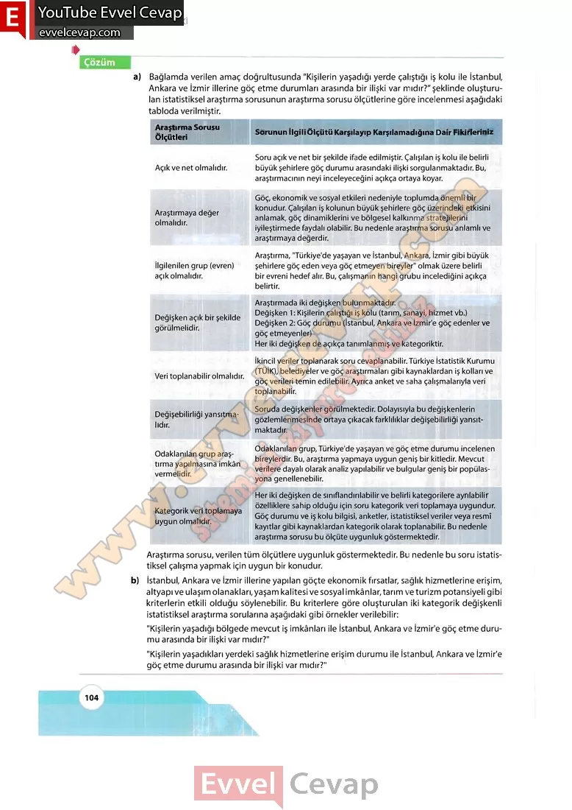

## 10. Sınıf Matematik Ders Kitabı Cevapları Meb Yayınları Sayfa 104

a) Bağlamda verilen amaç doğrultusunda “Kişilerin yaşadığı yerde çalıştığı iş kolu ile İstanbul, Ankara ve İzmir illerine göç etme durumları arasında bir ilişki var mıdır?” şeklinde oluşturulan istatistiksel araştırma sorusunun araştırma sorusu ölçütlerine göre incelenmesi aşağıdaki tabloda verilmiştir.

Araştırma sorusu, verilen tüm ölçütlere uygunluk göstermektedir. Bu nedenle bu soru istatistiksel çalışma yapmak için uygun bir konudur.  
 b) İstanbul, Ankara ve İzmir illerine yapılan göçte ekonomik fırsatlar, sağlık hizmetlerine erişim, altyapı ve ulaşım olanakları, yaşam kalitesi ve sosyal imkânlar, tarım ve turizm potansiyeli gibi kriterlerin etkili olduğu söylenebilir. Bu kriterlere göre oluşturulan iki kategorik değişkenli istatistiksel araştırma sorularına aşağıdaki gibi örnekler verilebilir:  
 “Kişilerin yaşadığı bölgede mevcut iş imkânları ile İstanbul, Ankara ve İzmir’e göç etme durumu arasında bir ilişki var mıdır?”  
 “Kişilerin yaşadıkları yerdeki sağlık hizmetlerine erişim durumu ile İstanbul, Ankara ve İzmir’e göç etme durumu arasında bir ilişki var mıdır?”

* **Cevap**: **Bu sayfada soru bulunmamaktadır.**

**10. Sınıf Meb Yayınları Matematik Ders Kitabı Sayfa 104**