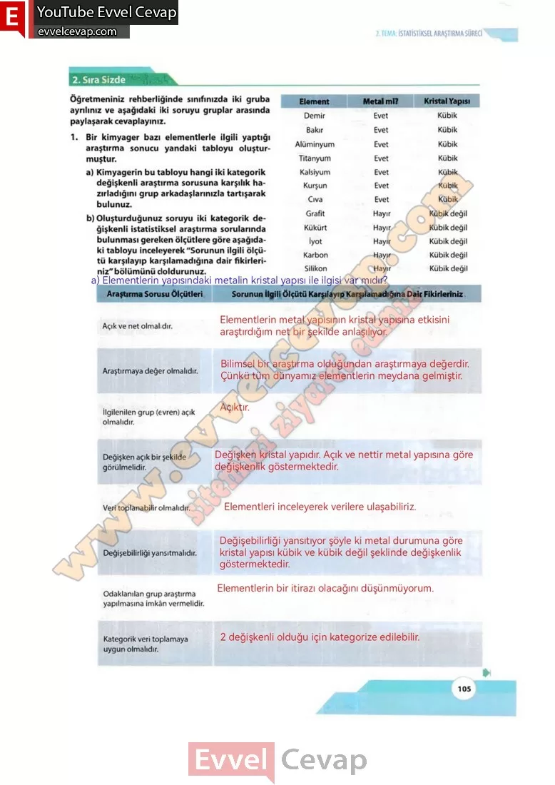

## 10. Sınıf Matematik Ders Kitabı Cevapları Meb Yayınları Sayfa 105

**2. Sıra Sizde**

**Soru:****Öğretmeniniz rehberliğinde sınıfınızda iki gruba ayrılınız ve aşağıdaki iki soruyu gruplar arasında paylaşarak cevaplayınız.**

**Soru: 1) Bir kimyager bazı elementlerle ilgili yaptığı araştırma sonucu yandaki tabloyu oluşturmuştur.**

**Soru: a) Kimyagerin bu tabloyu hangi iki kategorik değişkenli araştırma sorusuna karşılık hazırladığını grup arkadaşlarınızla tartışarak bulunuz.**

**Soru: b) Oluşturduğunuz soruyu iki kategorik değişkenli istatistiksel araştırma sorularında bulunması gereken ölçütlere göre aşağıdaki tabloyu inceleyerek “Sorunun ilgili ölçütü karşılayıp karşılamadığına dair fikirleriniz” bölümünü doldurunuz.**

Açık ve net olmalıdır.  
 Araştırmaya değer olmalıdır.  
 İlgilenilen grup (evren) açık olmalıdır.  
 Değişken açık bir şekilde görülmelidir.  
 Veri toplanabilir olmalıdır.  
 Değişebilirliği yansıtmalıdır.  
 Odaklanılan grup araştırma yapılmasına imkân vermelidir.  
 Kategorik veri toplamaya uygun olmalıdır.

**10. Sınıf Meb Yayınları Matematik Ders Kitabı Sayfa 105**