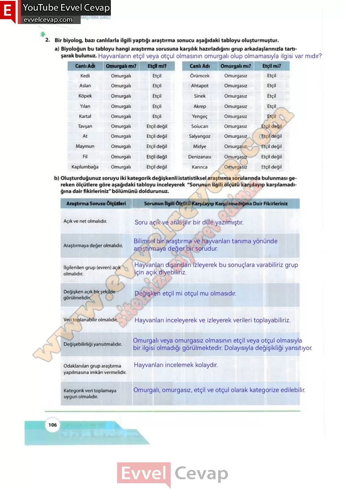

## 10. Sınıf Matematik Ders Kitabı Cevapları Meb Yayınları Sayfa 106

**Soru: 2) Bir biyolog, bazı canlılarla ilgili yaptığı araştırma sonucu aşağıdaki tabloyu oluşturmuştur.**

**Soru: a) Biyoloğun bu tabloyu hangi araştırma sorusuna karşılık hazırladığını grup arkadaşlarınızla tartışarak bulunuz.**

**Soru: b) Oluşturduğunuz soruyu iki kategorik değişkenli istatistiksel araştırma sorularında bulunması gereken ölçütlere göre aşağıdaki tabloyu inceleyerek “Sorunun ilgili ölçütü karşılayıp karşılamadığına dair fikirleriniz” bölümünü doldurunuz.**

Açık ve net olmalıdır.  
 Araştırmaya değer olmalıdır.  
 İlgilenilen grup (evren) açık olmalıdır.  
 Değişken açık bir şekilde görülmelidir.  
 Veri toplanabilir olmalıdır.  
 Değişebilirliği yansıtmalıdır.  
 Odaklanılan grup araştırma yapılmasına imkân vermelidir.  
 Kategorik veri toplamaya uygun olmalıdır.

**10. Sınıf Meb Yayınları Matematik Ders Kitabı Sayfa 106**