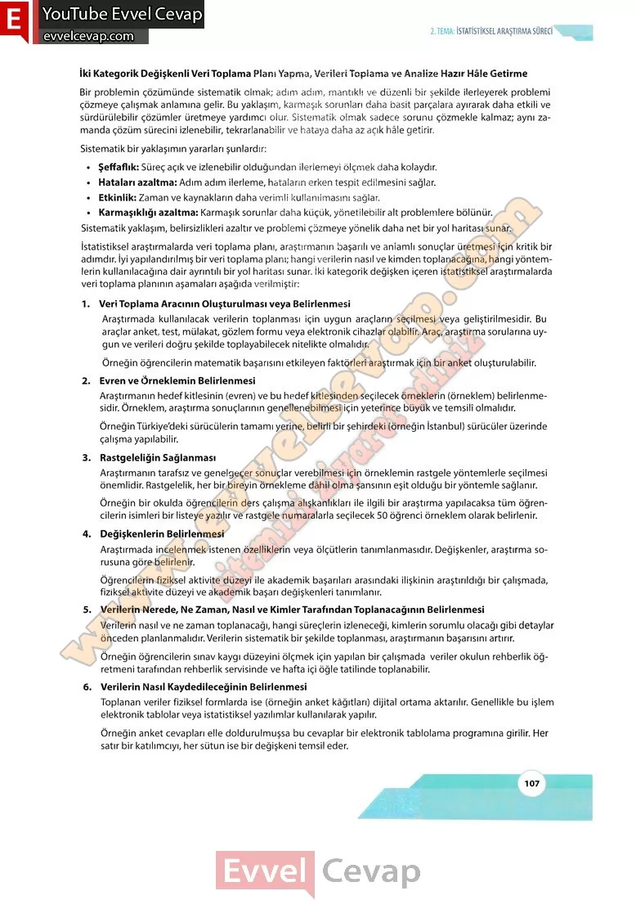

## 10. Sınıf Matematik Ders Kitabı Cevapları Meb Yayınları Sayfa 107

İki Kategorik Değişkenli Veri Toplama Plans Yapma, Verilen Toplama ve Analize Hazır Hâle Getirme  
 Bir problemin çözümünde sistematik olmak; adım adım, mantıklı ve düzenli bir şekilde ilerleyerek problemi çözmeye çalışmak anlamına gelir. Bu yaklaşım, karmaşık sorunları daha basit parçalara ayırarak daha etkili ve sürdürülebilir çözümler üretmeye yardımcı olur. Sistematik olmak sadece sorunu çözmekle kalmaz; aynı zamanda çözüm sürecini izlenebilir, tekrarlanabilir ve hataya daha az açık hâle getirir.  
 Sistematik bir yaklaşımın yararları şunlardır:  
 • Şeffaflık: Süreç açık ve izlenebilir olduğundan ilerlemeyi ölçmek daha kolaydır.  
 • Hataları azaltma: Adım adım ilerleme, hataların erken tespit edilmesini sağlar.  
 • Etkinlik: Zaman ve kaynakların daha verimli kullanılmasını sağlar.  
 • Karmaşıklığı azaltma: Karmaşık sorunlar daha küçük, yönetilebilir alt problemlere bölünür. Sistematik yaklaşım, belirsizlikleri azaltır ve problemi çözmeye yönelik daha net bir yol haritası sunar.  
 İstatistiksel araştırmalarda veri toplama planı, araştırmanın başarılı ve anlamlı sonuçlar üretmesi için kritik bir adımdır. İyi yapılandırılmış bir veri toplama planı; hangi verilerin nasıl ve kimden toplanacağına, hangi yöntem-  
 yo! haritası sunar. İki kategorik değişken içeren istatistiksel araştırmalarda  
 veri toplama planının aşamaları aşağıda verilmiştir:  
 1. Veri Toplama Aracının Oluşturulması veya Belirlenmesi  
 Araştırmada kullanılacak verilerin toplanması için uygun araçların seçilmesi veya geliştirilmesidir. Bu araçlar anket, test, mülakat, gözlem formu veya elektronik cihazlar olabilir. Araç, araştırma sorularına uygun ve verileri doğru şekilde toplayabilecek nitelikte olmalıdır.  
 Örneğin öğrencilerin matematik başarısını etkileyen faktörleri araştırmak için bir anket oluşturulabilir.  
 2. Evren ve Örneklemin Belirlenmesi  
 Araştırmanın hedef kitlesinin (evren) ve bu hedef kitlesinden seçilecek örneklerin (örneklem) belirlenmesidir. Örneklem, araştırma sonuçlarının genellenebilmesi için yeterince büyük ve temsilî olmalıdır.  
 Örneğin Türkiye’deki sürücülerin tamamı yerine, belirli bir şehirdeki (örneğin İstanbul) sürücüler üzerinde çalışma yapılabilir.  
 3. Rastgelelîğin Sağlanması  
 Araştırmanın tarafsız ve genelgeçer sonuçlar verebilmesi için örneklemin rastgele yöntemlerle seçilmesi önemlidir. Rastgelelik, her bir bireyin örnekleme dâhil olma şansının eşit olduğu bir yöntemle sağlanır.  
 Örneğin bir okulda öğrencilerin ders çalışma alışkanlıkları ile ilgili bir araştırma yapılacaksa tüm öğrencilerin isimleri bir listeye yazılır ve rastgele numaralarla seçilecek 50 öğrenci örneklem olarak belirlenir.  
 4. Değişkenlerin Belirlenmesi  
 Araştırmada incelenmek istenen özelliklerin veya ölçütlerin tanımlanmasıdır. Değişkenler, araştırma sorusuna göre belirlenir.  
 Öğrencilerin fiziksel aktivite düzeyi ile akademik başarıları arasındaki ilişkinin araştırıldığı bir çalışmada, fiziksel aktivite düzeyi ve akademik başarı değişkenleri tanımlanır.  
 5. Verilerin Nerede, Ne Zaman, Nasıl ve Kimler Tarafından Toplanacağının Belirlenmesi  
 Verilerin nasıl ve ne zaman toplanacağı, hangi süreçlerin izleneceği, kimlerin sorumlu olacağı gibi detaylar önceden planlanmalıdır. Verilerin sistematik bir şekilde toplanması, araştırmanın başarısını artırır.  
 Örneğin öğrencilerin sınav kaygı düzeyini ölçmek için yapılan bir çalışmada veriler okulun rehberlik öğretmeni tarafından rehberlik servisinde ve hafta içi öğle tatilinde toplanabilir.  
 6. Verilerin Nasıl Kaydedileceğinin Belirlenmesi  
 Toplanan veriler fiziksel formlarda ise (örneğin anket kâğıtları) dijital ortama aktarılır. Genellikle bu işlem elektronik tablolar veya istatistiksel yazılımlar kullanılarak yapılır.  
 Örneğin anket cevapları elle doldurulmuşsa bu cevaplar bir elektronik tablolama programına girilir. Her satır bir katılımcıyı, her sütun ise bir değişkeni temsil eder.

* **Cevap**: **Bu sayfada soru bulunmamaktadır.**

**10. Sınıf Meb Yayınları Matematik Ders Kitabı Sayfa 107**