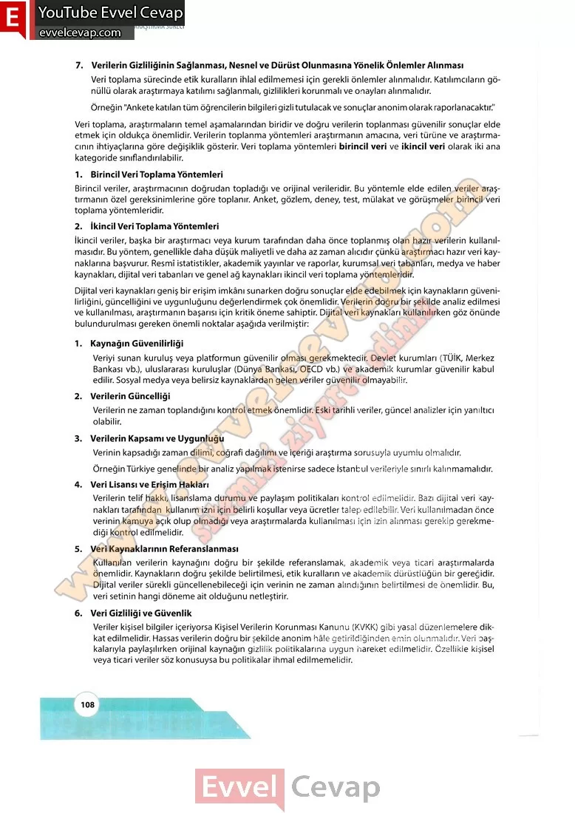

## 10. Sınıf Matematik Ders Kitabı Cevapları Meb Yayınları Sayfa 108

7. Verilerin Gizliliğinin Sağlanması, Nesnel ve Dürüst Olunmasına Yönelik Önlemler Alınması  
 Veri toplama sürecinde etik kuralların ihlal edilmemesi için gerekli önlemler alınmalıdır. Katılımcıların gönüllü olarak araştırmaya katılımı sağlanmalı, gizlilikleri korunmalı ve onayları alınmalıdır.  
 Örneğin “Ankete katılan tüm öğrencilerin bilgileri gizli tutulacak ve sonuçlar anonim olarak raporlanacaktır.”  
 Veri toplama, araştırmaların temel aşamalarından biridir ve doğru verilerin toplanması güvenilir sonuçlar elde etmek için oldukça önemlidir. Verilerin toplanma yöntemleri araştırmanın amacına, veri türüne ve araştırmacının ihtiyaçlarına göre değişiklik gösterir. Veri toplama yöntemleri birincil veri ve ikincil veri olarak iki ana kategoride sınıflandırılabilir.  
 1. Birincil Veri Toplama Yöntemleri  
 Birincil veriler, araştırmacının doğrudan topladığı ve orijinal verileridir. Bu yöntemle elde edilen veriler araştırmanın özel gereksinimlerine göre toplanır. Anket, gözlem, deney, test, mülakat ve görüşmeler birincil veri toplama yöntemleridir.  
 2. İkinci! Veri TopSama Yöntemleri  
 İkincil veriler, başka bir araştırmacı veya kurum tarafından daha önce toplanmış olan hazır verilerin kullanılmasıdır. Bu yöntem, genellikle daha düşük maliyetli ve daha az zaman alıcıdır çünkü araştırmacı hazır veri kaynaklarına başvurur. Resmî istatistikler, akademik yayınlar ve raporlar, kurumsal veri tabanları, medya ve haber kaynakları, dijital veri tabanları ve genel ağ kaynakları ikincil veri toplama yöntemleridir.  
 Dijital veri kaynakları geniş bir erişim imkânı sunarken doğru sonuçlar elde edebilmek için kaynakların güvenilirliğini, güncelliğini ve uygunluğunu değerlendirmek çok önemlidir. Verilerin doğru bir şekilde analiz edilmesi ve kullanılması, araştırmanın başarısı için kritik öneme sahiptir. Dijital veri kaynakları kullanılırken göz önünde bulundurulması gereken önemli noktalar aşağıda verilmiştir:  
 1. Kaynağın Güvenilirliği  
 Veriyi sunan kuruluş veya platformun güvenilir olması gerekmektedir. Devlet kurumlan (TÜİK, Merkez Bankası vb.), uluslararası kuruluşlar (Dünya Bankası, OECD vb.) ve akademik kurumlar güvenilir kabul edilir. Sosyal medya veya belirsiz kaynaklardan gelen veriler güvenilir olmayabilir.  
 2. Verilerin Güncelliği  
 Verilerin ne zaman toplandığını kontrol etmek önemlidir. Eski tarihli veriler, güncel analizler için yamltıcı olabilir.  
 3. Verilerin Kapsamı ve Uygunluğu  
 Verinin kapsadığı zaman dilimi, coğrafi dağılımı ve içeriği araştırma sorusuyla uyumlu olmalıdır.  
 Örneğin Türkiye genelinde bir analiz yapılmak istenirse sadece İstanbul verileriyle sınırlı kalınmamalıdır.  
 4. Veri Lisansı ve Erişim Hakları  
 Verilerin telif hakkı, lisanslama durumu ve paylaşım politikaları kontrol edilmelidir. Bazı dijital veri kaynakları tarafından kullanım izni için belirli koşullar veya ücretler talep edilebilir. Veri kullanılmadan önce verinin kamuya açık olup olmadığı veya araştırmalarda kullanılması için izin alınması gerekip gerekmediği kontrol edilmelidir.  
 5. Veri Kaynaklarının Referanslanması  
 Kullanılan verilerin kaynağını doğru bir şekilde referanslamak, akademik veya ticari araştırmalarda önemlidir. Kaynakların doğru şekilde belirtilmesi, etik kuralların ve akademik dürüstlüğün bir gereğidir. Dijital veriler sürekli güncellenebileceği için verinin ne zaman alındığının belirtilmesi de önemlidir. Bu, veri setinin hangi döneme ait olduğunu netleştirin  
 6. Veri Gizliliği ve Güvenlik  
 Veriler kişisel bilgiler içeriyorsa Kişisel Verilerin Korunması Kanunu (KVKK) gibi yasal düzenlemelere dikkat edilmelidir. Hassas verilerin doğru bir şekilde anonim hâle getirildiğinden emin olunmalıdır. Veri başkalarıyla paylaşılırken orijinal kaynağın gizlilik politikalarına uygun hareket edilmelidir. Özellikle kişisel veya ticari veriler söz konusuysa bu politikalar ihmal edilmemelidir.

* **Cevap**: **Bu sayfada soru bulunmamaktadır.**

**10. Sınıf Meb Yayınları Matematik Ders Kitabı Sayfa 108**