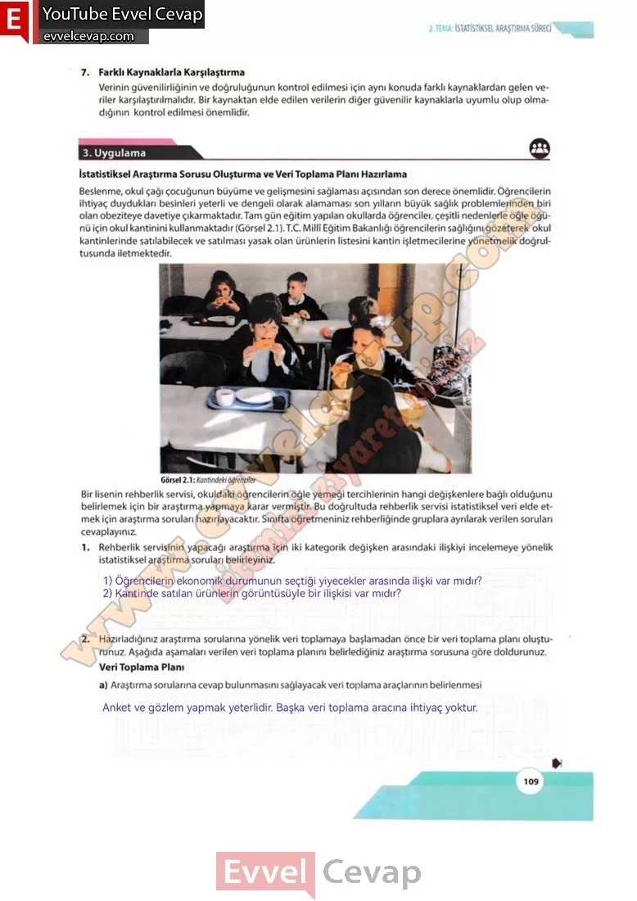

## 10. Sınıf Matematik Ders Kitabı Cevapları Meb Yayınları Sayfa 109

7. Farklı Kaynaklarla Karşılaştırma  
 Verinin güvenilirliğinin ve doğruluğunun kontrol edilmesi için aynı konuda farklı kaynaklardan gelen veriler karşılaştırılmalıdır. Bir kaynaktan elde edilen verilerin diğer güvenilir kaynaklarla uyumlu olup olmadığının kontrol edilmesi önemlidir.

**3. Uygulama**

**İstatistiksel Araştırma Sorusu Oluşturma ve Veri Toplama Planı Hazırlama**

Beslenme, okul çağı çocuğunun büyüme ve gelişmesini sağlaması açısından son derece önemlidir. Öğrencilerin ihtiyaç duydukları besinleri yeterli ve dengeli olarak alamaması son yılların büyük sağlık problemlerinden biri olan obeziteye davetiye çıkarmaktadır.Tam gün eğitim yapılan okullarda öğrenciler, çeşitli nedenlerle öğle öğünü için okul kantinini kullanmaktadır (Görsel 2.1 ).T.C. Millî Eğitim Bakanlığı öğrencilerin sağlığını gözeterek okul kantinlerinde satılabilecek ve satılması yasak olan ürünlerin listesini kantin işletmecilerine yönetmelik doğrultusunda iletmektedir.

**Soru: Bir lisenin rehberlik servisi, okuldaki öğrencilerin öğle yemeği tercihlerinin hangi değişkenlere bağlı olduğunu belirlemek için bir araştırma yapmaya karar vermiştir. Bu doğrultuda rehberlik servisi istatistiksel veri elde etmek için araştırma soruları hazırlayacaktır. Sınıfta öğretmeniniz rehberliğinde gruplara ayrılarak verilen soruları cevaplayınız.**

**Soru: 1) Rehberlik servisinin yapacağı araştırma için iki kategorik değişken arasındaki ilişkiyi incelemeye yönelik istatistiksel araştırma soruları belirleyiniz.**

**Soru: 2) Hazırladığınız araştırma sorularına yönelik veri toplamaya başlamadan önce bir veri toplama planı oluşturunuz. Aşağıda aşamaları verilen veri toplama planını belirlediğiniz araştırma sorusuna göre doldurunuz.**

**Soru: a) Araştırma sorularına cevap bulunmasını sağlayacak veri toplama araçlarının belirlenmesi**

**10. Sınıf Meb Yayınları Matematik Ders Kitabı Sayfa 109**