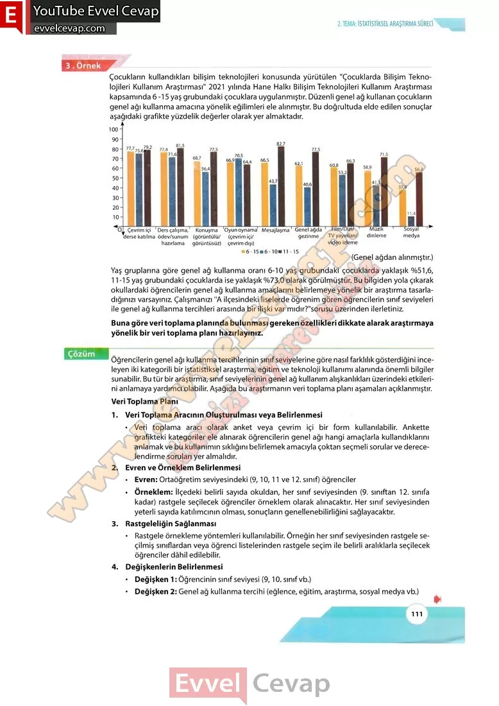

## 10. Sınıf Matematik Ders Kitabı Cevapları Meb Yayınları Sayfa 111

Çocukların kullandıkları bilişim teknolojileri konusunda yürütülen “Çocuklarda Bilişim Teknolojileri Kullanım Araştırması” 2021 yılında Hane Halkı Bilişim Teknolojileri Kullanım Araştırması kapsamında 6-15 yaş grubundaki çocuklara uygulanmıştır. Düzenli genel ağ kullanan çocukların genel ağı kullanma amacına yönelik eğilimleri ele alınmıştır. Bu doğrultuda elde edilen sonuçlar  
 aşağıdaki grafikte yüzdelik değerler olarak yer almaktadır,

Yaş gruplarına göre genel ağ kullanma oranı 6-10 yaş grubundaki çocuklarda yaklaşık %51,6, 11-15 yaş grubundaki çocuklarda ise yaklaşık %73,0 olarak görülmüştür. Bu bilgiden yola çıkarak okullardaki öğrencilerin genel ağ kullanma amaçlarını belirlemeye yönelik bir araştırma tasarladığınızı varsayınız. Çalışmanızı MA ilçesindeki liselerde öğrenim gören öğrencilerin sınıf seviyeleri ile genel ağ kullanma tercihleri arasında bir ilişki var mıdır?”sorusu üzerinden ilerletiniz.  
 Buna göre veri toplama planında bulunması gereken özellikleri dikkate alarak araştırmaya yönelik bir veri toplama planı hazırlayınız.

Öğrencilerin genel ağı kullanma tercihlerinin sınıf seviyelerine göre nasıl farklılık gösterdiğini inceleyen iki kategorili bir istatistiksel araştırma, eğitim ve teknoloji kullanımı alanında önemli bilgiler sunabilir. Bu tür bir araştırma, sınıf seviyelerinin genel ağ kullanım alışkanlıkları üzerindeki etkilerini anlamaya yardımcı olabilir. Aşağıda bu araştırmanın veri toplama planı aşamaları açıklanmıştır.  
 Veri Toplama Planı  
 1. Veri Toplama Aracının Oluşturulması veya Belirlenmesi  
 • Veri toplama aracı olarak anket veya çevrim içi bir form kullanılabilir. Ankette grafikteki kategoriler ele alınarak öğrencilerin genel ağı hangi amaçlarla kullandıklarını anlamak ve bu kullanımın sıklığını belirlemek amacıyla çoktan seçmeli sorular ve derecelendirme soruları yer almalıdır.  
 2. Evren ve Örneklem Belirlenmesi  
 • Evren: Ortaöğretim seviyesindeki (9,10,11 ve 12. sınıf) öğrenciler  
 • Örneklem: İlçedeki belirli sayıda okuldan, her sınıf seviyesinden (9. sınıftan 12. sınıfa kadar) rastgele seçilecek öğrenciler örneklem olarak alınacaktır. Her sınıf seviyesinden yeterli sayıda katılımcının olması, sonuçların genellenebilirliğini sağlayacaktır.  
 3. Rastgeleliğin Sağlanması  
 • Rastgele örnekleme yöntemleri kullanılabilir. Örneğin her sınıf seviyesinden rastgele seçilmiş sınıflardan veya öğrenci listelerinden rastgele seçim ile belirli aralıklarla seçilecek öğrenciler dâhil edilebilir.  
 4. Değişkenlerin Belirlenmesi  
 • Değişken 1: Öğrencinin sınıf seviyesi (9,10. sınıf vb.)  
 • Değişken 2: Genel ağ kullanma tercihi (eğlence, eğitim, araştırma, sosyal medya vb.)

* **Cevap**: **Bu sayfada soru bulunmamaktadır.**

**10. Sınıf Meb Yayınları Matematik Ders Kitabı Sayfa 111**