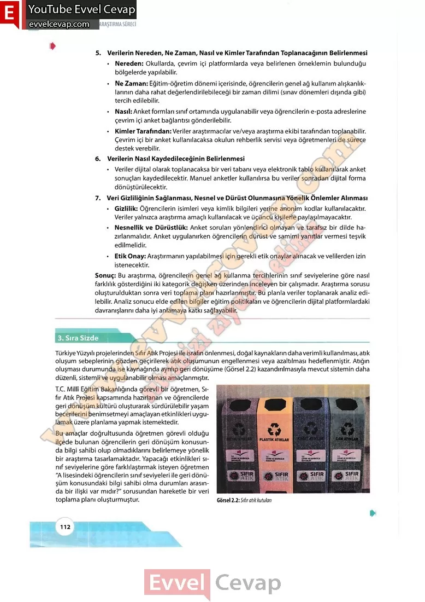

## 10. Sınıf Matematik Ders Kitabı Cevapları Meb Yayınları Sayfa 112

5. Verilerin Nereden, Ne Zaman, Nasıl ve Kimler Tarafından Toplanacağının Belirlenmesi  
 • Nereden: Okullarda, çevrim içi platformlarda veya belirlenen örneklemin bulunduğu bölgelerde yapılabilir.  
 • Ne Zaman: Eğitim-öğretim dönemi içerisinde, öğrencilerin genel ağ kullanım alışkanlıklarının daha rahat değerlendirilebileceği bir zaman dilimi (sınav dönemleri dışında gibi) tercih edilebilir.  
 • Nasıl: Anket formları sınıf ortamında uygulanabilir veya öğrencilerin e-posta adreslerine çevrim içi anket bağlantısı gönderilebilir.  
 • Kimler Tarafından: Veriler araştırmacılar ve/veya araştırma ekibi tarafından toplanabilir. Çevrim içi bir anket kullanılacaksa okulun rehberlik servisi veya öğretmenleri de sürece destek verebilir.  
 6. Verilerin Nasıl Kaydedileceğinin Belirlenmesi  
 • Veriler dijital olarak toplanacaksa bir veri tabanı veya elektronik tablo kullanılarak anket sonuçları kaydedilecektir. Manuel anketler kullanılırsa bu veriler sonradan dijital forma dönüştürülecektir.  
 7. Veri Gizliliğinin Sağlanması, Nesnel ve Dürüst Olunmasına Yönelik Önlemler Alınması  
 • Gizlilik: Öğrencilerin isimleri veya kimlik bilgileri yerine anonim kodlar kullanılacaktır. Veriler yalnızca araştırma amaçlı kullanılacak ve üçüncü kişilerle paylaşamayacaktır.  
 • Nesnellik ve Dürüstlük: Anket soruları yönlendirici olmayan ve tarafsız bir dilde ha- zırlanmalıdır. Anket uygulanırken öğrencilerin dürüst ve samimi yanıtlar vermesi teşvik edilmelidir.  
 • Etik Onay: Araştırmanın yapılabilmesi için gerekli etik onaylar alınacak ve velilerden izin istenecektir.  
 Sonuç: Bu araştırma, öğrencilerin genel ağ kullanma tercihlerinin sınıf seviyelerine göre nasıl farklılık gösterdiğini iki kategorik değişken üzerinden inceleyen bir çalışmadır. Araştırma sorusu oluşturulduktan sonra veri toplama planı hazırlanmıştır. Bu planla veriler toplanarak analiz edilebilir. Analiz sonucu elde edilen bilgiler eğitim politikaları ve öğrencilerin dijital platformlardaki davranışlarını daha iyi anlamaya katkı sağlayabilir.

**3. Sıra Sizde**

Türkiye Yüzyılı projelerinden Sıfır Atık Projesi ile israfın önlenmesi, doğal kaynakların daha verimli kullanılması, atık oluşum sebeplerinin gözden geçirilerek atık oluşumunun engellenmesi veya azaltılması hedeflenmiştir. Atığın oluşması durumunda ise kaynağında ayrılıp geri dönüşüme (Görsel 2.2) kazandırılmasıyla mevcut sistemin daha düzenli, sistemli ve uygulanabilir olması amaçlanmıştır.  
 T.C. Millî Eğitim Bakanlığında görevli bir öğretmen, Sıfır Atık Projesi kapsamında hazırlanan ve öğrencilerde geri dönüşüm kültürü oluşturarak sürdürülebilir yaşam becerilerini benimsetmeyi amaçlayan etkinlikleri uygulamak üzere planlama yapmak istemektedir.

**Soru: Bu amaçlar doğrultusunda öğretmen görevli olduğu ilçede bulunan öğrencilerin geri dönüşüm konusunda bilgi sahibi olup olmadıklarını belirlemeye yönelik bir araştırma tasarlamaktadır. Yapacağı etkinlikleri sınıf seviyelerine göre farklılaştırmak isteyen öğretmen “A lisesindeki öğrencilerin sınıf seviyeleri ile geri dönüşüm konusundaki bilgi sahibi olma durumları arasında bir ilişki var mıdır?” sorusundan hareketle bir veri toplama planı oluşturmuştur.**

**10. Sınıf Meb Yayınları Matematik Ders Kitabı Sayfa 112**